# Chainlink Multi-Agent Swarm Cross-Chain AI Prediction Market Arbitrage Network
## Architecture Diagrams & User Flows

## 1. Overall System Architecture

```mermaid
graph TB
    subgraph "User Interfaces"
        UI1[Web Dashboard]
        UI2[Discord Bot]
        UI3[Telegram Bot]
        UI4[Twitter Bot]
        UI5[Direct API]
    end

    subgraph "Eliza Framework - Agent Orchestration Layer"
        subgraph "7 Specialized AI Agents"
            A1[Arbitrage Coordinator<br/>🎯 Central Orchestrator]
            A2[Market Intelligence<br/>📊 Data Analysis]
            A3[Cross-Chain Bridge<br/>🌉 CCIP Operations]
            A4[AI Computation<br/>🧠 ML Processing]
            A5[Automation Agent<br/>⚡ Scheduling]
            A6[Randomization Agent<br/>🎲 VRF Services]
            A7[Treasury Agent<br/>💰 Portfolio Management]
        end
        
        subgraph "Eliza Plugins"
            P1[plugin-chainlink-ccip]
            P2[plugin-chainlink-data-streams]
            P3[plugin-chainlink-functions]
            P4[plugin-chainlink-vrf]
            P5[plugin-chainlink-automation]
            P6[plugin-polymarket]
            P7[plugin-cross-chain-arbitrage]
        end
    end

    subgraph "Smart Contracts Layer"
        subgraph "Ethereum Sepolia"
            SC1[ArbitrageCoordinator.sol]
            SC2[PredictionMarketDataStreams.sol]
        end
        
        subgraph "Base Sepolia"
            SC3[ArbitrageCoordinator.sol]
            SC4[PredictionMarketDataStreams.sol]
        end
        
        subgraph "Polygon Amoy"
            SC5[ArbitrageCoordinator.sol]
            SC6[PredictionMarketDataStreams.sol]
        end
        
        subgraph "Arbitrum Sepolia"
            SC7[ArbitrageCoordinator.sol]
            SC8[PredictionMarketDataStreams.sol]
        end
        
        subgraph "Avalanche Fuji"
            SC9[ArbitrageCoordinator.sol]
            SC10[PredictionMarketDataStreams.sol]
        end
    end

    subgraph "Chainlink Services Layer"
        CL1[CCIP Routers<br/>🌉 Cross-Chain Messaging]
        CL2[Data Streams<br/>📊 Real-time Market Data]
        CL3[Functions<br/>🧠 Serverless Compute]
        CL4[VRF<br/>🎲 Verifiable Randomness]
        CL5[Automation<br/>⚡ Decentralized Scheduling]
        CL6[Data Feeds<br/>📈 Price Oracles]
    end

    subgraph "External Data Sources"
        EXT1[Polymarket API<br/>🎯 Prediction Markets]
        EXT2[CEX APIs<br/>📈 Price Data]
        EXT3[News APIs<br/>📰 Market Events]
        EXT4[Social Media<br/>💭 Sentiment Data]
        EXT5[On-Chain Analytics<br/>⛓️ Blockchain Data]
    end

    %% User Interface Connections
    UI1 --> A1
    UI2 --> A1
    UI3 --> A1
    UI4 --> A1
    UI5 --> A1

    %% Agent Interactions
    A1 -.-> A2
    A1 -.-> A3
    A1 -.-> A4
    A1 -.-> A5
    A1 -.-> A6
    A1 -.-> A7
    A2 -.-> A4
    A3 -.-> A1
    A4 -.-> A2

    %% Plugin Connections
    A1 --> P7
    A2 --> P2
    A2 --> P6
    A3 --> P1
    A4 --> P3
    A5 --> P5
    A6 --> P4
    A7 --> P1

    %% Smart Contract Connections
    P1 --> SC1
    P1 --> SC3
    P1 --> SC5
    P1 --> SC7
    P1 --> SC9
    P2 --> SC2
    P2 --> SC4
    P2 --> SC6
    P2 --> SC8
    P2 --> SC10

    %% Chainlink Service Connections
    SC1 --> CL1
    SC1 --> CL3
    SC1 --> CL4
    SC2 --> CL2
    SC2 --> CL5
    
    %% External Data Connections
    A2 --> EXT1
    A2 --> EXT2
    A4 --> EXT3
    A4 --> EXT4
    A4 --> EXT5

    classDef userInterface fill:#e1f5fe,stroke:#01579b,stroke-width:2px
    classDef agent fill:#f3e5f5,stroke:#4a148c,stroke-width:2px
    classDef plugin fill:#e8f5e8,stroke:#1b5e20,stroke-width:2px
    classDef contract fill:#fff3e0,stroke:#e65100,stroke-width:2px
    classDef chainlink fill:#fce4ec,stroke:#880e4f,stroke-width:2px
    classDef external fill:#f1f8e9,stroke:#33691e,stroke-width:2px

    class UI1,UI2,UI3,UI4,UI5 userInterface
    class A1,A2,A3,A4,A5,A6,A7 agent
    class P1,P2,P3,P4,P5,P6,P7 plugin
    class SC1,SC2,SC3,SC4,SC5,SC6,SC7,SC8,SC9,SC10 contract
    class CL1,CL2,CL3,CL4,CL5,CL6 chainlink
    class EXT1,EXT2,EXT3,EXT4,EXT5 external
```



## 2. Agent Interaction Flow


## 3. Plugin Architecture & Chainlink Integration

```mermaid
graph TB
    subgraph "Agent Layer"
        A1[Arbitrage Coordinator]
        A2[Market Intelligence]
        A3[Cross-Chain Bridge]
        A4[AI Computation]
        A5[Automation]
        A6[Randomization]
        A7[Treasury]
    end

    subgraph "Plugin Layer"
        subgraph "Chainlink Plugins"
            P1[plugin-chainlink-ccip<br/>📦 Cross-chain messaging<br/>🔧 Transaction management<br/>🌉 Bridge operations]
            P2[plugin-chainlink-data-streams<br/>📦 Real-time market data<br/>🔧 High-frequency feeds<br/>📊 Price aggregation]
            P3[plugin-chainlink-functions<br/>📦 Serverless compute<br/>🔧 ML model execution<br/>🧠 AI processing]
            P4[plugin-chainlink-vrf<br/>📦 Verifiable randomness<br/>🔧 Strategy diversification<br/>🎲 Parameter selection]
            P5[plugin-chainlink-automation<br/>📦 Decentralized scheduling<br/>🔧 Job management<br/>⚡ Trigger execution]
        end
        
        subgraph "Market Plugins"
            P6[plugin-polymarket<br/>📦 Prediction market API<br/>🔧 Market data fetching<br/>🎯 Trade execution]
            P7[plugin-cross-chain-arbitrage<br/>📦 Arbitrage coordination<br/>🔧 Strategy management<br/>💰 Profit calculation]
        end
    end

    subgraph "Blockchain Layer"
        subgraph "Smart Contracts"
            SC1[ArbitrageCoordinator.sol<br/>🎯 Central coordination<br/>🔗 CCIP integration<br/>🧠 Functions calls<br/>🎲 VRF requests<br/>⚡ Automation jobs]
            SC2[PredictionMarketDataStreams.sol<br/>📊 Data stream consumption<br/>📈 Market price tracking<br/>🔍 Arbitrage detection<br/>⚡ Automated updates]
        end
        
        subgraph "Chainlink Infrastructure"
            CL1[CCIP Routers<br/>Cross-chain messaging]
            CL2[Data Streams DON<br/>High-frequency data]
            CL3[Functions DON<br/>Serverless compute]
            CL4[VRF Coordinator<br/>Random number generation]
            CL5[Automation Registry<br/>Job scheduling]
        end
    end

    %% Agent to Plugin Connections
    A1 --> P1
    A1 --> P3
    A1 --> P4
    A1 --> P5
    A1 --> P7
    A2 --> P2
    A2 --> P3
    A2 --> P6
    A3 --> P1
    A3 --> P2
    A4 --> P3
    A4 --> P2
    A5 --> P5
    A6 --> P4
    A7 --> P1
    A7 --> P2

    %% Plugin to Contract Connections
    P1 --> SC1
    P2 --> SC2
    P3 --> SC1
    P4 --> SC1
    P5 --> SC1
    P5 --> SC2
    P6 --> SC2
    P7 --> SC1

    %% Contract to Chainlink Connections
    SC1 --> CL1
    SC1 --> CL3
    SC1 --> CL4
    SC1 --> CL5
    SC2 --> CL2
    SC2 --> CL5

    classDef agent fill:#f3e5f5,stroke:#4a148c,stroke-width:2px
    classDef chainlinkPlugin fill:#fce4ec,stroke:#880e4f,stroke-width:2px
    classDef marketPlugin fill:#e8f5e8,stroke:#1b5e20,stroke-width:2px
    classDef contract fill:#fff3e0,stroke:#e65100,stroke-width:2px
    classDef chainlinkInfra fill:#e1f5fe,stroke:#01579b,stroke-width:2px

    class A1,A2,A3,A4,A5,A6,A7 agent
    class P1,P2,P3,P4,P5 chainlinkPlugin
    class P6,P7 marketPlugin
    class SC1,SC2 contract
    class CL1,CL2,CL3,CL4,CL5 chainlinkInfra
```



## 4. Cross-Chain Arbitrage Execution Flow

```mermaid
graph TB
    subgraph "Detection Phase"
        D1[Market Intelligence Agent<br/>📊 Scans prediction markets]
        D2[AI Computation Agent<br/>🧠 ML analysis & predictions]
        D3[Data Streams Plugin<br/>📈 Real-time price feeds]
        D4[Arbitrage Detection<br/>🔍 Price discrepancy found]
    end

    subgraph "Analysis Phase"
        A1[Risk Assessment<br/>⚖️ Treasury Agent evaluation]
        A2[Position Sizing<br/>📊 AI Computation optimization]
        A3[Route Planning<br/>🌉 Cross-Chain Bridge analysis]
        A4[Strategy Randomization<br/>🎲 VRF-based parameters]
    end

    subgraph "Execution Phase"
        E1[CCIP Message Prep<br/>📝 Cross-chain parameters]
        E2[Source Chain Transaction<br/>⛓️ Initial position entry]
        E3[Cross-Chain Bridge<br/>🌉 CCIP transfer execution]
        E4[Destination Chain Settlement<br/>⛓️ Position closure]
        E5[Profit Calculation<br/>💰 Returns analysis]
    end

    subgraph "Monitoring Phase"
        M1[Automation Triggers<br/>⚡ Scheduled monitoring]
        M2[Real-time Tracking<br/>👁️ Position monitoring]
        M3[Risk Management<br/>🛡️ Stop-loss execution]
        M4[Performance Analytics<br/>📈 Strategy optimization]
    end

    D1 --> D2
    D2 --> D3
    D3 --> D4
    
    D4 --> A1
    A1 --> A2
    A2 --> A3
    A3 --> A4
    
    A4 --> E1
    E1 --> E2
    E2 --> E3
    E3 --> E4
    E4 --> E5
    
    E1 --> M1
    M1 --> M2
    M2 --> M3
    M3 --> M4
    
    M4 -.-> D1

    classDef detection fill:#e8f5e8,stroke:#1b5e20,stroke-width:2px
    classDef analysis fill:#f3e5f5,stroke:#4a148c,stroke-width:2px
    classDef execution fill:#fff3e0,stroke:#e65100,stroke-width:2px
    classDef monitoring fill:#e1f5fe,stroke:#01579b,stroke-width:2px

    class D1,D2,D3,D4 detection
    class A1,A2,A3,A4 analysis
    class E1,E2,E3,E4,E5 execution
    class M1,M2,M3,M4 monitoring
```



## 5. User Interaction Flow & Contract Functions

```mermaid
graph TB
    subgraph "User Entry Points"
        U1[Web Dashboard Login]
        U2[Discord Commands]
        U3[Telegram Bot]
        U4[API Calls]
        U5[Twitter Monitoring]
    end

    subgraph "Authentication & Setup"
        AUTH1[User Authentication]
        AUTH2[Wallet Connection]
        AUTH3[Permission Verification]
        AUTH4[Agent Authorization]
    end

    subgraph "Core Operations"
        OP1[Scan Markets<br/>requestMarketData()]
        OP2[Generate Predictions<br/>requestPrediction()]
        OP3[Execute Arbitrage<br/>executeArbitrage()]
        OP4[Monitor Positions<br/>getActivePositions()]
        OP5[Manage Portfolio<br/>updatePortfolioLimits()]
    end

    subgraph "Contract Functions Called"
        CF1[ArbitrageCoordinator.registerAgent()]
        CF2[ArbitrageCoordinator.requestMarketData()]
        CF3[ArbitrageCoordinator.requestPrediction()]
        CF4[ArbitrageCoordinator.executeArbitrage()]
        CF5[ArbitrageCoordinator.getArbitrageOpportunities()]
        CF6[PredictionMarketDataStreams.updatePricesWithVerifiedReports()]
        CF7[PredictionMarketDataStreams.getLatestPrice()]
        CF8[PredictionMarketDataStreams.setUpkeepInterval()]
        CF9[ArbitrageCoordinator.emergencyStop()]
        CF10[ArbitrageCoordinator.withdrawProfits()]
    end

    subgraph "Chainlink Service Triggers"
        CL1[Functions Request<br/>Market Analysis]
        CL2[VRF Request<br/>Strategy Randomization]
        CL3[CCIP Send<br/>Cross-chain Transfer]
        CL4[Automation Job<br/>Scheduled Execution]
        CL5[Data Streams<br/>Price Updates]
    end

    %% User Entry Flow
    U1 --> AUTH1
    U2 --> AUTH1
    U3 --> AUTH1
    U4 --> AUTH1
    U5 --> AUTH1

    AUTH1 --> AUTH2
    AUTH2 --> AUTH3
    AUTH3 --> AUTH4

    %% Operations Flow
    AUTH4 --> OP1
    AUTH4 --> OP2
    AUTH4 --> OP3
    AUTH4 --> OP4
    AUTH4 --> OP5

    %% Contract Function Mapping
    OP1 --> CF2
    OP1 --> CF6
    OP1 --> CF7
    
    OP2 --> CF3
    OP2 --> CF5
    
    OP3 --> CF4
    OP3 --> CF9
    OP3 --> CF10
    
    OP4 --> CF5
    OP4 --> CF7
    
    OP5 --> CF8
    OP5 --> CF1

    %% Chainlink Integration
    CF2 --> CL1
    CF3 --> CL1
    CF4 --> CL2
    CF4 --> CL3
    CF6 --> CL5
    CF8 --> CL4

    classDef user fill:#e1f5fe,stroke:#01579b,stroke-width:2px
    classDef auth fill:#f3e5f5,stroke:#4a148c,stroke-width:2px
    classDef operation fill:#e8f5e8,stroke:#1b5e20,stroke-width:2px
    classDef contract fill:#fff3e0,stroke:#e65100,stroke-width:2px
    classDef chainlink fill:#fce4ec,stroke:#880e4f,stroke-width:2px

    class U1,U2,U3,U4,U5 user
    class AUTH1,AUTH2,AUTH3,AUTH4 auth
    class OP1,OP2,OP3,OP4,OP5 operation
    class CF1,CF2,CF3,CF4,CF5,CF6,CF7,CF8,CF9,CF10 contract
    class CL1,CL2,CL3,CL4,CL5 chainlink
```

## 6. Detailed Smart Contract Interaction Flow


## 7. Multi-Chain Deployment Architecture

```mermaid
graph TB
    subgraph "Multi-Chain Deployment"
        subgraph "Ethereum Sepolia"
            ES1[ArbitrageCoordinator<br/>0x1234...ABCD]
            ES2[PredictionMarketDataStreams<br/>0x5678...EFGH]
            ES3[Chainlink Services<br/>🔗 CCIP, Functions, VRF]
        end
        
        subgraph "Base Sepolia"
            BS1[ArbitrageCoordinator<br/>0x9012...IJKL]
            BS2[PredictionMarketDataStreams<br/>0x3456...MNOP]
            BS3[Chainlink Services<br/>🔗 CCIP, Automation]
        end
        
        subgraph "Polygon Amoy"
            PS1[ArbitrageCoordinator<br/>0x7890...QRST]
            PS2[PredictionMarketDataStreams<br/>0x1234...UVWX]
            PS3[Chainlink Services<br/>🔗 CCIP, Data Streams]
        end
        
        subgraph "Arbitrum Sepolia"
            AS1[ArbitrageCoordinator<br/>0x5678...YZAB]
            AS2[PredictionMarketDataStreams<br/>0x9012...CDEF]
            AS3[Chainlink Services<br/>🔗 CCIP, VRF]
        end
        
        subgraph "Avalanche Fuji"
            AV1[ArbitrageCoordinator<br/>0x3456...GHIJ]
            AV2[PredictionMarketDataStreams<br/>0x7890...KLMN]
            AV3[Chainlink Services<br/>🔗 CCIP, Functions]
        end
    end

    subgraph "Cross-Chain Message Flow"
        CCIP1[CCIP Router Network<br/>🌉 Secure Cross-chain Messaging]
        FLOW1[Ethereum → Base<br/>Arbitrage Opportunity]
        FLOW2[Polygon → Arbitrum<br/>Liquidity Rebalancing]
        FLOW3[Avalanche → Ethereum<br/>Profit Settlement]
    end

    subgraph "Shared Infrastructure"
        LINK[LINK Token<br/>💎 Service Payments]
        SUBS[Chainlink Subscriptions<br/>📋 VRF, Functions, Automation]
        MONITORING[Monitoring Dashboard<br/>📊 Multi-chain Status]
    end

    %% Cross-chain connections
    ES1 -.-> CCIP1
    BS1 -.-> CCIP1
    PS1 -.-> CCIP1
    AS1 -.-> CCIP1
    AV1 -.-> CCIP1

    CCIP1 --> FLOW1
    CCIP1 --> FLOW2
    CCIP1 --> FLOW3

    %% Shared resource connections
    ES1 --> LINK
    BS1 --> LINK
    PS1 --> LINK
    AS1 --> LINK
    AV1 --> LINK

    ES1 --> SUBS
    BS1 --> SUBS
    PS1 --> SUBS
    AS1 --> SUBS
    AV1 --> SUBS

    MONITORING --> ES1
    MONITORING --> BS1
    MONITORING --> PS1
    MONITORING --> AS1
    MONITORING --> AV1

    classDef ethereum fill:#627eea,color:#fff,stroke:#627eea,stroke-width:2px
    classDef base fill:#0052ff,color:#fff,stroke:#0052ff,stroke-width:2px
    classDef polygon fill:#8247e5,color:#fff,stroke:#8247e5,stroke-width:2px
    classDef arbitrum fill:#28a0f0,color:#fff,stroke:#28a0f0,stroke-width:2px
    classDef avalanche fill:#e84142,color:#fff,stroke:#e84142,stroke-width:2px
    classDef ccip fill:#375bd2,color:#fff,stroke:#375bd2,stroke-width:2px
    classDef shared fill:#f8f9fa,stroke:#6c757d,stroke-width:2px

    class ES1,ES2,ES3 ethereum
    class BS1,BS2,BS3 base
    class PS1,PS2,PS3 polygon
    class AS1,AS2,AS3 arbitrum
    class AV1,AV2,AV3 avalanche
    class CCIP1,FLOW1,FLOW2,FLOW3 ccip
    class LINK,SUBS,MONITORING shared