# 🤖 Agent Architecture
## Detailed Architecture of AI Agents in the Chainlink Multi-Agent Swarm

## 🏗️ **Agent System Overview**

The Chainlink Multi-Agent Swarm consists of 7 specialized AI agents, each designed for specific functions within the cross-chain arbitrage ecosystem. These agents operate collaboratively using the Eliza Framework to execute sophisticated trading strategies.

```mermaid
graph TB
    subgraph "Agent Coordination Layer"
        COORD[Arbitrage Coordinator<br/>🎯 Master Orchestrator]
        COORD --> MI[Market Intelligence<br/>🧠 Data Analysis]
        COORD --> CB[Cross-Chain Bridge<br/>🌉 CCIP Operations]
        COORD --> AI[AI Computation<br/>⚡ ML Processing]
        COORD --> AU[Automation<br/>🤖 Job Scheduling]
        COORD --> RA[Randomization<br/>🎲 Strategy Diversification]
        COORD --> TA[Treasury<br/>💰 Risk Management]
    end
    
    subgraph "Communication Layer"
        MSG[Message Bus]
        EVENTS[Event System]
        STATE[State Management]
    end
    
    subgraph "External Integrations"
        CHAINLINK[Chainlink Services]
        POLYMARKET[Polymarket API]
        BLOCKCHAIN[Multi-Chain Networks]
    end
    
    COORD -.-> MSG
    MI -.-> MSG
    CB -.-> MSG
    AI -.-> MSG
    AU -.-> MSG
    RA -.-> MSG
    TA -.-> MSG
    
    MSG --> EVENTS
    EVENTS --> STATE
    
    COORD --> CHAINLINK
    MI --> POLYMARKET
    CB --> BLOCKCHAIN
    
    classDef coordinator fill:#ff9800,color:#fff,stroke:#e65100,stroke-width:3px
    classDef agent fill:#2196f3,color:#fff,stroke:#0d47a1,stroke-width:2px
    classDef communication fill:#4caf50,color:#fff,stroke:#1b5e20,stroke-width:2px
    classDef external fill:#9c27b0,color:#fff,stroke:#4a148c,stroke-width:2px
    
    class COORD coordinator
    class MI,CB,AI,AU,RA,TA agent
    class MSG,EVENTS,STATE communication
    class CHAINLINK,POLYMARKET,BLOCKCHAIN external
```



## 🎯 **Agent Specifications**

### **1. Arbitrage Coordinator Agent**

**Role**: Master orchestrator responsible for coordinating all arbitrage operations across the multi-agent system.

#### **Core Capabilities**
- **Strategy Coordination**: Orchestrates complex multi-step arbitrage strategies
- **Agent Management**: Delegates tasks to specialized agents
- **Risk Assessment**: Evaluates and manages overall system risk
- **Performance Optimization**: Continuously improves strategy execution

#### **Architecture**
```typescript
interface ArbitrageCoordinatorAgent extends ElizaAgent {
  capabilities: {
    strategyOrchestration: StrategyOrchestrator;
    agentCoordination: AgentCoordinator;
    riskManagement: RiskManager;
    performanceOptimizer: PerformanceOptimizer;
  };
  
  chainlinkServices: {
    ccip: CCIPService;
    functions: FunctionsService;
    vrf: VRFService;
    automation: AutomationService;
  };
  
  state: {
    activeStrategies: Strategy[];
    agentStatus: AgentStatus[];
    riskMetrics: RiskMetrics;
    performanceData: PerformanceData;
  };
}
```

#### **Key Functions**
```typescript
class ArbitrageCoordinatorAgent {
  async orchestrateArbitrage(opportunity: ArbitrageOpportunity): Promise<ExecutionResult> {
    // 1. Validate opportunity
    const validation = await this.validateOpportunity(opportunity);
    if (!validation.isValid) return validation.result;
    
    // 2. Plan execution strategy
    const strategy = await this.planStrategy(opportunity);
    
    // 3. Coordinate agents
    const coordination = await this.coordinateAgents(strategy);
    
    // 4. Monitor execution
    return await this.monitorExecution(coordination.executionId);
  }
  
  async coordinateAgents(strategy: Strategy): Promise<CoordinationResult> {
    const tasks = this.breakdownStrategy(strategy);
    const assignments = await this.assignTasks(tasks);
    return await this.executeCoordination(assignments);
  }
}
```

### **2. Market Intelligence Agent**

**Role**: Analyzes prediction markets, generates insights, and identifies arbitrage opportunities using real-time data.

#### **Core Capabilities**
- **Real-time Market Analysis**: Processes high-frequency market data
- **Trend Prediction**: Uses ML models for market forecasting
- **Sentiment Analysis**: Analyzes social media and news sentiment
- **Opportunity Scoring**: Ranks arbitrage opportunities by potential

#### **Architecture**
```typescript
interface MarketIntelligenceAgent extends ElizaAgent {
  capabilities: {
    dataAnalysis: MarketAnalyzer;
    trendPrediction: TrendPredictor;
    sentimentAnalysis: SentimentAnalyzer;
    opportunityScoring: OpportunityScorer;
  };
  
  dataSources: {
    chainlinkDataStreams: DataStreamsService;
    polymarketAPI: PolymarketService;
    newsFeeds: NewsService[];
    socialMedia: SocialMediaService[];
  };
  
  models: {
    pricePredictor: MLModel;
    sentimentClassifier: MLModel;
    volatilityPredictor: MLModel;
  };
}
```

#### **Analysis Pipeline**
```typescript
class MarketIntelligenceAgent {
  async analyzeMarkets(): Promise<MarketAnalysis> {
    // 1. Collect real-time data
    const marketData = await this.collectMarketData();
    
    // 2. Process with ML models
    const predictions = await this.generatePredictions(marketData);
    
    // 3. Analyze sentiment
    const sentiment = await this.analyzeSentiment();
    
    // 4. Identify opportunities
    const opportunities = await this.identifyOpportunities(predictions, sentiment);
    
    // 5. Score and rank
    return await this.scoreOpportunities(opportunities);
  }
  
  async generatePredictions(data: MarketData): Promise<Predictions> {
    const priceForecasts = await this.models.pricePredictor.predict(data.prices);
    const volatilityForecasts = await this.models.volatilityPredictor.predict(data.volatility);
    
    return {
      priceForecasts,
      volatilityForecasts,
      confidence: this.calculateConfidence(priceForecasts, volatilityForecasts)
    };
  }
}
```

### **3. Cross-Chain Bridge Agent**

**Role**: Manages CCIP transactions, optimizes cross-chain routes, and handles liquidity management.

#### **Core Capabilities**
- **CCIP Transaction Management**: Executes cross-chain transfers
- **Route Optimization**: Finds optimal paths across chains
- **Liquidity Management**: Manages cross-chain liquidity pools
- **Transaction Monitoring**: Tracks cross-chain transaction status

#### **Architecture**
```typescript
interface CrossChainBridgeAgent extends ElizaAgent {
  capabilities: {
    ccipManagement: CCIPManager;
    routeOptimization: RouteOptimizer;
    liquidityManagement: LiquidityManager;
    transactionMonitoring: TransactionMonitor;
  };
  
  chainlinkServices: {
    ccip: CCIPService;
  };
  
  supportedChains: {
    ethereum: ChainConfig;
    base: ChainConfig;
    polygon: ChainConfig;
    arbitrum: ChainConfig;
    avalanche: ChainConfig;
  };
}
```

#### **Cross-Chain Execution**
```typescript
class CrossChainBridgeAgent {
  async executeCrossChainArbitrage(
    sourceChain: ChainId,
    targetChain: ChainId,
    amount: bigint,
    strategy: ArbitrageStrategy
  ): Promise<CrossChainResult> {
    // 1. Optimize route
    const route = await this.optimizeRoute(sourceChain, targetChain, amount);
    
    // 2. Check liquidity
    const liquidityCheck = await this.checkLiquidity(route);
    if (!liquidityCheck.sufficient) {
      return { success: false, error: 'Insufficient liquidity' };
    }
    
    // 3. Execute CCIP transfer
    const transfer = await this.executeCCIPTransfer(route, amount, strategy);
    
    // 4. Monitor completion
    return await this.monitorTransfer(transfer.messageId);
  }
  
  async optimizeRoute(
    source: ChainId,
    target: ChainId,
    amount: bigint
  ): Promise<OptimalRoute> {
    const routes = await this.getAllRoutes(source, target);
    const routeAnalysis = await Promise.all(
      routes.map(route => this.analyzeRoute(route, amount))
    );
    
    return routeAnalysis.reduce((best, current) => 
      current.cost < best.cost ? current : best
    );
  }
}
```

### **4. AI Computation Agent**

**Role**: Executes AI/ML computations using Chainlink Functions, processes complex market analysis, and generates trading signals.

#### **Core Capabilities**
- **ML Model Execution**: Runs prediction models via Chainlink Functions
- **Complex Analysis**: Performs computationally intensive market analysis
- **Signal Generation**: Creates trading signals from analysis results
- **Model Management**: Maintains and updates ML models

#### **Architecture**
```typescript
interface AIComputationAgent extends ElizaAgent {
  capabilities: {
    modelExecution: ModelExecutor;
    complexAnalysis: ComplexAnalyzer;
    signalGeneration: SignalGenerator;
    modelManagement: ModelManager;
  };
  
  chainlinkServices: {
    functions: FunctionsService;
  };
  
  models: {
    arbitragePrediction: MLModel;
    riskAssessment: MLModel;
    marketRegimePrediction: MLModel;
    portfolioOptimization: MLModel;
  };
}
```

#### **Computation Pipeline**
```typescript
class AIComputationAgent {
  async executeMLComputation(
    modelType: ModelType,
    inputData: any,
    parameters: ComputationParameters
  ): Promise<ComputationResult> {
    // 1. Prepare computation request
    const request = await this.prepareComputationRequest(modelType, inputData, parameters);
    
    // 2. Execute via Chainlink Functions
    const functionResult = await this.chainlinkServices.functions.executeComputation(request);
    
    // 3. Process results
    const processedResult = await this.processComputationResult(functionResult);
    
    // 4. Update model performance metrics
    await this.updateModelMetrics(modelType, processedResult);
    
    return processedResult;
  }
  
  async generateTradingSignals(marketData: MarketData): Promise<TradingSignals> {
    const predictions = await this.executeMLComputation(
      ModelType.ARBITRAGE_PREDICTION,
      marketData,
      { horizon: '1h', confidence: 0.8 }
    );
    
    return this.convertPredictionsToSignals(predictions);
  }
}
```

### **5. Automation Agent**

**Role**: Manages automated job scheduling, monitors system health, and executes recurring tasks using Chainlink Automation.

#### **Core Capabilities**
- **Job Scheduling**: Manages automated task execution
- **Health Monitoring**: Monitors system and agent health
- **Recurring Tasks**: Executes periodic maintenance and optimization
- **Alert Management**: Handles system alerts and notifications

#### **Architecture**
```typescript
interface AutomationAgent extends ElizaAgent {
  capabilities: {
    jobScheduling: JobScheduler;
    healthMonitoring: HealthMonitor;
    taskExecution: TaskExecutor;
    alertManagement: AlertManager;
  };
  
  chainlinkServices: {
    automation: AutomationService;
  };
  
  scheduledJobs: {
    marketScanning: ScheduledJob;
    healthChecks: ScheduledJob;
    performanceReporting: ScheduledJob;
    riskAssessment: ScheduledJob;
  };
}
```

### **6. Randomization Agent**

**Role**: Provides verifiable randomness for strategy diversification, timing optimization, and MEV protection using Chainlink VRF.

#### **Core Capabilities**
- **Strategy Randomization**: Diversifies execution strategies
- **Timing Optimization**: Randomizes execution timing to avoid MEV
- **Portfolio Diversification**: Randomizes portfolio allocations
- **A/B Testing**: Provides randomness for strategy testing

#### **Architecture**
```typescript
interface RandomizationAgent extends ElizaAgent {
  capabilities: {
    strategyRandomization: StrategyRandomizer;
    timingOptimization: TimingOptimizer;
    portfolioDiversification: PortfolioDiversifier;
    abTesting: ABTester;
  };
  
  chainlinkServices: {
    vrf: VRFService;
  };
  
  randomnessRequests: {
    pending: VRFRequest[];
    fulfilled: VRFResult[];
  };
}
```

### **7. Treasury Agent**

**Role**: Manages multi-chain portfolio, monitors risk metrics, and optimizes capital allocation across chains.

#### **Core Capabilities**
- **Portfolio Management**: Tracks assets across all chains
- **Risk Monitoring**: Monitors and manages portfolio risk
- **Capital Allocation**: Optimizes fund distribution
- **Performance Tracking**: Tracks trading performance metrics

#### **Architecture**
```typescript
interface TreasuryAgent extends ElizaAgent {
  capabilities: {
    portfolioManagement: PortfolioManager;
    riskMonitoring: RiskMonitor;
    capitalAllocation: CapitalAllocator;
    performanceTracking: PerformanceTracker;
  };
  
  chainlinkServices: {
    dataFeeds: DataFeedsService;
  };
  
  portfolio: {
    positions: Position[];
    riskMetrics: RiskMetrics;
    performanceMetrics: PerformanceMetrics;
  };
}
```

## 🔄 **Agent Communication Patterns**

### **Message Passing Architecture**

```typescript
interface AgentMessage {
  id: string;
  from: AgentId;
  to: AgentId | 'broadcast';
  type: MessageType;
  payload: any;
  timestamp: number;
  priority: Priority;
}

enum MessageType {
  TASK_ASSIGNMENT = 'task_assignment',
  STATUS_UPDATE = 'status_update',
  DATA_SHARE = 'data_share',
  ALERT = 'alert',
  COORDINATION_REQUEST = 'coordination_request'
}
```

### **Event-Driven Communication**

```typescript
class AgentEventBus {
  async publishEvent(event: AgentEvent): Promise<void> {
    const subscribers = this.getSubscribers(event.type);
    await Promise.all(
      subscribers.map(agent => agent.handleEvent(event))
    );
  }
  
  async subscribeToEvents(agentId: AgentId, eventTypes: EventType[]): Promise<void> {
    eventTypes.forEach(type => {
      this.subscriptions.set(type, [...(this.subscriptions.get(type) || []), agentId]);
    });
  }
}
```

## 📊 **Agent Performance Monitoring**

### **Performance Metrics**

```typescript
interface AgentPerformanceMetrics {
  responseTime: {
    average: number;
    p95: number;
    p99: number;
  };
  
  throughput: {
    messagesPerSecond: number;
    tasksPerMinute: number;
  };
  
  accuracy: {
    predictionAccuracy: number;
    executionSuccessRate: number;
  };
  
  efficiency: {
    resourceUtilization: number;
    costPerOperation: number;
  };
}
```

### **Health Monitoring**

```typescript
class AgentHealthMonitor {
  async checkAgentHealth(agentId: AgentId): Promise<HealthStatus> {
    const agent = this.agents.get(agentId);
    
    return {
      status: await this.getAgentStatus(agent),
      uptime: await this.getUptime(agent),
      memoryUsage: await this.getMemoryUsage(agent),
      lastActivity: await this.getLastActivity(agent),
      errors: await this.getRecentErrors(agent),
      performance: await this.getPerformanceMetrics(agent)
    };
  }
}
```

## 🔧 **Agent Configuration & Deployment**

### **Agent Configuration Schema**

```typescript
interface AgentConfiguration {
  id: AgentId;
  name: string;
  type: AgentType;
  
  capabilities: Capability[];
  plugins: Plugin[];
  
  resources: {
    memory: string;
    cpu: string;
    storage: string;
  };
  
  networking: {
    endpoints: Endpoint[];
    security: SecurityConfig;
  };
  
  monitoring: {
    metrics: MetricConfig[];
    alerts: AlertConfig[];
  };
}
```

### **Deployment Strategy**

```typescript
class AgentDeploymentManager {
  async deployAgent(config: AgentConfiguration): Promise<DeploymentResult> {
    // 1. Validate configuration
    await this.validateConfiguration(config);
    
    // 2. Allocate resources
    const resources = await this.allocateResources(config.resources);
    
    // 3. Initialize agent
    const agent = await this.initializeAgent(config, resources);
    
    // 4. Start monitoring
    await this.startMonitoring(agent);
    
    // 5. Register with coordinator
    await this.registerWithCoordinator(agent);
    
    return { agent, status: 'deployed' };
  }
}
```

---

This comprehensive agent architecture provides the foundation for sophisticated, coordinated AI operations in the Chainlink Multi-Agent Swarm system, enabling efficient cross-chain arbitrage execution with robust monitoring and management capabilities. 