# 📊 Data Flow Diagrams
## Comprehensive Data Flow Architecture for Chainlink Multi-Agent Swarm

## 🌊 **System-Wide Data Flow Overview**

The Chainlink Multi-Agent Swarm processes multiple data streams from various sources to enable intelligent cross-chain arbitrage decisions. This document details the complete data flow architecture from ingestion to execution.

```mermaid
graph TB
    subgraph "Data Sources"
        DS1[Chainlink Data Streams<br/>📊 Real-time Prices]
        DS2[Polymarket API<br/>🎯 Prediction Markets]
        DS3[News APIs<br/>📰 Market Sentiment]
        DS4[Social Media<br/>🐦 Community Sentiment]
        DS5[On-Chain Data<br/>⛓️ Blockchain Events]
        DS6[CEX APIs<br/>💱 Exchange Data]
    end
    
    subgraph "Data Ingestion Layer"
        INGEST[Data Ingestion Service<br/>🔄 Real-time Collection]
        NORM[Data Normalizer<br/>📏 Format Standardization]
        VALID[Data Validator<br/>✅ Quality Assurance]
        CACHE[Data Cache<br/>⚡ Fast Access]
    end
    
    subgraph "Processing Layer"
        PROC1[Market Intelligence Agent<br/>🧠 Analysis]
        PROC2[AI Computation Agent<br/>⚡ ML Processing]
        PROC3[Risk Assessment<br/>⚠️ Risk Analysis]
        PROC4[Opportunity Detection<br/>🎯 Arbitrage Finder]
    end
    
    subgraph "Decision Layer"
        DEC[Arbitrage Coordinator<br/>🎯 Strategy Decision]
        EXEC[Execution Planner<br/>📋 Action Planning]
        RISK[Risk Manager<br/>🛡️ Risk Control]
    end
    
    subgraph "Output Layer"
        OUT1[Cross-Chain Bridge<br/>🌉 CCIP Execution]
        OUT2[Treasury Management<br/>💰 Portfolio Updates]
        OUT3[Monitoring<br/>📊 Performance Tracking]
        OUT4[Alerts<br/>🚨 Notifications]
    end
    
    DS1 --> INGEST
    DS2 --> INGEST
    DS3 --> INGEST
    DS4 --> INGEST
    DS5 --> INGEST
    DS6 --> INGEST
    
    INGEST --> NORM
    NORM --> VALID
    VALID --> CACHE
    
    CACHE --> PROC1
    CACHE --> PROC2
    CACHE --> PROC3
    CACHE --> PROC4
    
    PROC1 --> DEC
    PROC2 --> DEC
    PROC3 --> RISK
    PROC4 --> DEC
    
    DEC --> EXEC
    RISK --> EXEC
    
    EXEC --> OUT1
    EXEC --> OUT2
    EXEC --> OUT3
    EXEC --> OUT4
    
    classDef source fill:#e3f2fd,stroke:#1976d2,stroke-width:2px
    classDef ingestion fill:#f3e5f5,stroke:#7b1fa2,stroke-width:2px
    classDef processing fill:#e8f5e8,stroke:#388e3c,stroke-width:2px
    classDef decision fill:#fff3e0,stroke:#f57c00,stroke-width:2px
    classDef output fill:#fce4ec,stroke:#c2185b,stroke-width:2px
    
    class DS1,DS2,DS3,DS4,DS5,DS6 source
    class INGEST,NORM,VALID,CACHE ingestion
    class PROC1,PROC2,PROC3,PROC4 processing
    class DEC,EXEC,RISK decision
    class OUT1,OUT2,OUT3,OUT4 output
```



## 📈 **Real-Time Market Data Flow**

### **Chainlink Data Streams Integration**


### **Data Stream Processing Pipeline**

```typescript
interface DataStreamProcessor {
  async processDataStream(streamData: DataStreamUpdate): Promise<ProcessedData> {
    // 1. Validate incoming data
    const validation = await this.validateStreamData(streamData);
    if (!validation.isValid) {
      throw new Error(`Invalid data: ${validation.errors.join(', ')}`);
    }
    
    // 2. Normalize data format
    const normalizedData = await this.normalizeData(streamData);
    
    // 3. Enrich with historical context
    const enrichedData = await this.enrichWithContext(normalizedData);
    
    // 4. Cache for fast access
    await this.cacheData(enrichedData);
    
    // 5. Trigger analysis
    return await this.triggerAnalysis(enrichedData);
  }
  
  private async enrichWithContext(data: NormalizedData): Promise<EnrichedData> {
    const historical = await this.getHistoricalData(data.feedId, '24h');
    const volatility = this.calculateVolatility(historical);
    const trend = this.calculateTrend(historical);
    
    return {
      ...data,
      context: {
        historical,
        volatility,
        trend,
        confidence: this.calculateConfidence(data, historical)
      }
    };
  }
}
```

## 🎯 **Arbitrage Opportunity Detection Flow**

### **Multi-Source Analysis Pipeline**


### **Opportunity Detection Algorithm**

```typescript
class ArbitrageOpportunityDetector {
  async detectOpportunities(): Promise<ArbitrageOpportunity[]> {
    const opportunities: ArbitrageOpportunity[] = [];
    
    // 1. Get current market data across all chains
    const marketData = await this.getAllChainMarketData();
    
    // 2. Compare prices across chains for each market
    for (const market of this.supportedMarkets) {
      const chainPrices = await this.getChainPrices(market, marketData);
      const priceDifferences = this.calculatePriceDifferences(chainPrices);
      
      // 3. Filter for significant price differences
      const significantDifferences = priceDifferences.filter(
        diff => diff.percentage > this.minProfitThreshold
      );
      
      // 4. Validate execution feasibility
      for (const diff of significantDifferences) {
        const opportunity = await this.validateOpportunity(market, diff);
        if (opportunity.isValid) {
          opportunities.push(opportunity);
        }
      }
    }
    
    // 5. Score and rank opportunities
    return this.scoreAndRankOpportunities(opportunities);
  }
  
  private async validateOpportunity(
    market: Market,
    priceDiff: PriceDifference
  ): Promise<ArbitrageOpportunity> {
    // Check liquidity
    const liquidity = await this.checkLiquidity(market, priceDiff.chains);
    
    // Calculate gas costs
    const gasCosts = await this.calculateGasCosts(priceDiff.chains);
    
    // Estimate execution time
    const executionTime = await this.estimateExecutionTime(priceDiff.chains);
    
    // Calculate net profit
    const netProfit = priceDiff.profit - gasCosts.total;
    
    return {
      market,
      sourceChain: priceDiff.sourceChain,
      targetChain: priceDiff.targetChain,
      grossProfit: priceDiff.profit,
      gasCosts,
      netProfit,
      profitMargin: netProfit / priceDiff.amount,
      liquidity,
      executionTime,
      confidence: this.calculateConfidence(priceDiff, liquidity, gasCosts),
      isValid: netProfit > this.minNetProfit && liquidity.sufficient
    };
  }
}
```

## 🧠 **AI/ML Data Processing Flow**

### **Machine Learning Pipeline**

```mermaid
graph TB
    subgraph "Data Preparation"
        RAW[Raw Market Data<br/>📊 Multi-source Input]
        CLEAN[Data Cleaning<br/>🧹 Outlier Removal]
        FEAT[Feature Engineering<br/>🔧 Signal Extraction]
        SPLIT[Data Splitting<br/>📂 Train/Test Sets]
    end
    
    subgraph "Model Training"
        TRAIN[Model Training<br/>🎓 ML Algorithm]
        VALID[Model Validation<br/>✅ Performance Check]
        TUNE[Hyperparameter Tuning<br/>⚙️ Optimization]
        EVAL[Model Evaluation<br/>📊 Metrics Analysis]
    end
    
    subgraph "Prediction Generation"
        PRED[Prediction Engine<br/>🔮 Market Forecasting]
        CONF[Confidence Scoring<br/>📊 Uncertainty Estimation]
        CALIB[Prediction Calibration<br/>⚖️ Accuracy Adjustment]
    end
    
    subgraph "Decision Support"
        SIG[Signal Generation<br/>📡 Trading Signals]
        RISK[Risk Assessment<br/>⚠️ Risk Scoring]
        REC[Recommendations<br/>💡 Action Suggestions]
    end
    
    RAW --> CLEAN
    CLEAN --> FEAT
    FEAT --> SPLIT
    
    SPLIT --> TRAIN
    TRAIN --> VALID
    VALID --> TUNE
    TUNE --> EVAL
    
    EVAL --> PRED
    PRED --> CONF
    CONF --> CALIB
    
    CALIB --> SIG
    SIG --> RISK
    RISK --> REC
    
    classDef preparation fill:#e3f2fd,stroke:#1976d2,stroke-width:2px
    classDef training fill:#f3e5f5,stroke:#7b1fa2,stroke-width:2px
    classDef prediction fill:#e8f5e8,stroke:#388e3c,stroke-width:2px
    classDef decision fill:#fff3e0,stroke:#f57c00,stroke-width:2px
    
    class RAW,CLEAN,FEAT,SPLIT preparation
    class TRAIN,VALID,TUNE,EVAL training
    class PRED,CONF,CALIB prediction
    class SIG,RISK,REC decision
```



### **Chainlink Functions ML Execution**

```typescript
class ChainlinkMLProcessor {
  async executeMLPrediction(
    modelType: MLModelType,
    inputData: MarketData,
    parameters: PredictionParameters
  ): Promise<MLPredictionResult> {
    // 1. Prepare JavaScript code for Chainlink Functions
    const jsCode = this.generateMLCode(modelType, parameters);
    
    // 2. Create Functions request
    const request = await this.createFunctionsRequest(jsCode, inputData);
    
    // 3. Execute via Chainlink Functions
    const response = await this.functionsRouter.sendRequest(request);
    
    // 4. Process and validate response
    return await this.processPredictionResponse(response);
  }
  
  private generateMLCode(modelType: MLModelType, params: PredictionParameters): string {
    switch (modelType) {
      case MLModelType.PRICE_PREDICTION:
        return `
          // Price prediction model
          const tf = require('@tensorflow/tfjs-node');
          
          const predictPrice = async (marketData) => {
            // Load pre-trained model
            const model = await tf.loadLayersModel('${params.modelUrl}');
            
            // Prepare input tensor
            const inputTensor = tf.tensor2d([marketData.features]);
            
            // Make prediction
            const prediction = model.predict(inputTensor);
            
            // Return prediction with confidence
            return {
              price: await prediction.data(),
              confidence: calculateConfidence(marketData),
              timestamp: Date.now()
            };
          };
          
          return Functions.encodeString(JSON.stringify(await predictPrice(args[0])));
        `;
        
      case MLModelType.SENTIMENT_ANALYSIS:
        return `
          // Sentiment analysis model
          const sentiment = require('sentiment');
          const analyzer = new sentiment();
          
          const analyzeSentiment = async (textData) => {
            const results = textData.map(text => analyzer.analyze(text));
            const avgSentiment = results.reduce((sum, r) => sum + r.score, 0) / results.length;
            
            return {
              sentiment: avgSentiment,
              confidence: calculateSentimentConfidence(results),
              breakdown: results
            };
          };
          
          return Functions.encodeString(JSON.stringify(await analyzeSentiment(args[0])));
        `;
        
      default:
        throw new Error(`Unsupported model type: ${modelType}`);
    }
  }
}
```

## 🔄 **Cross-Chain Data Synchronization**

### **Multi-Chain State Synchronization**


### **Data Consistency Management**

```typescript
class CrossChainDataConsistencyManager {
  private chainStates: Map<ChainId, ChainState> = new Map();
  private inconsistencyThreshold = 0.05; // 5% price difference threshold
  
  async synchronizeChainStates(): Promise<SynchronizationResult> {
    // 1. Collect current state from all chains
    const currentStates = await this.collectAllChainStates();
    
    // 2. Detect inconsistencies
    const inconsistencies = await this.detectInconsistencies(currentStates);
    
    // 3. Resolve inconsistencies if possible
    const resolutions = await this.resolveInconsistencies(inconsistencies);
    
    // 4. Update local state cache
    await this.updateStateCache(currentStates);
    
    return {
      synchronized: true,
      inconsistencies: inconsistencies.length,
      resolved: resolutions.length,
      timestamp: Date.now()
    };
  }
  
  private async detectInconsistencies(
    states: Map<ChainId, ChainState>
  ): Promise<Inconsistency[]> {
    const inconsistencies: Inconsistency[] = [];
    
    // Compare prices across chains for each market
    for (const market of this.trackedMarkets) {
      const prices = new Map<ChainId, number>();
      
      for (const [chainId, state] of states) {
        const marketPrice = state.markets.get(market.id)?.price;
        if (marketPrice) {
          prices.set(chainId, marketPrice);
        }
      }
      
      // Find price discrepancies
      const priceArray = Array.from(prices.values());
      const minPrice = Math.min(...priceArray);
      const maxPrice = Math.max(...priceArray);
      const discrepancy = (maxPrice - minPrice) / minPrice;
      
      if (discrepancy > this.inconsistencyThreshold) {
        inconsistencies.push({
          type: 'price_discrepancy',
          market: market.id,
          discrepancy,
          affectedChains: Array.from(prices.keys()),
          severity: this.calculateSeverity(discrepancy)
        });
      }
    }
    
    return inconsistencies;
  }
}
```

## 📊 **Performance Monitoring Data Flow**

### **Real-Time Metrics Collection**

```mermaid
graph TB
    subgraph "Metric Sources"
        AGENT[Agent Metrics<br/>🤖 Performance Data]
        CHAIN[Blockchain Metrics<br/>⛓️ On-chain Data]
        PROFIT[Profit Metrics<br/>💰 Financial Data]
        RISK[Risk Metrics<br/>⚠️ Risk Data]
    end
    
    subgraph "Collection Layer"
        COLL[Metrics Collector<br/>📊 Data Aggregation]
        PROC[Metrics Processor<br/>⚙️ Data Processing]
        STORE[Metrics Storage<br/>🗄️ Time Series DB]
    end
    
    subgraph "Analysis Layer"
        TREND[Trend Analysis<br/>📈 Pattern Detection]
        ALERT[Alert Engine<br/>🚨 Anomaly Detection]
        REPORT[Report Generator<br/>📋 Insights]
    end
    
    subgraph "Visualization Layer"
        DASH[Dashboard<br/>📊 Real-time Display]
        API[Metrics API<br/>🔌 Data Access]
        EXPORT[Data Export<br/>📤 External Systems]
    end
    
    AGENT --> COLL
    CHAIN --> COLL
    PROFIT --> COLL
    RISK --> COLL
    
    COLL --> PROC
    PROC --> STORE
    
    STORE --> TREND
    STORE --> ALERT
    STORE --> REPORT
    
    TREND --> DASH
    ALERT --> DASH
    REPORT --> API
    API --> EXPORT
    
    classDef source fill:#e1f5fe,stroke:#01579b,stroke-width:2px
    classDef collection fill:#f3e5f5,stroke:#4a148c,stroke-width:2px
    classDef analysis fill:#e8f5e8,stroke:#1b5e20,stroke-width:2px
    classDef visualization fill:#fff3e0,stroke:#e65100,stroke-width:2px
    
    class AGENT,CHAIN,PROFIT,RISK source
    class COLL,PROC,STORE collection
    class TREND,ALERT,REPORT analysis
    class DASH,API,EXPORT visualization
```



### **Performance Data Pipeline**

```typescript
interface PerformanceDataPipeline {
  async collectMetrics(): Promise<MetricsCollection> {
    const metrics = await Promise.all([
      this.collectAgentMetrics(),
      this.collectChainMetrics(),
      this.collectProfitMetrics(),
      this.collectRiskMetrics()
    ]);
    
    return this.aggregateMetrics(metrics);
  }
  
  async processMetrics(metrics: MetricsCollection): Promise<ProcessedMetrics> {
    // 1. Validate metrics
    const validatedMetrics = await this.validateMetrics(metrics);
    
    // 2. Calculate derived metrics
    const derivedMetrics = await this.calculateDerivedMetrics(validatedMetrics);
    
    // 3. Detect anomalies
    const anomalies = await this.detectAnomalies(derivedMetrics);
    
    // 4. Generate alerts if necessary
    if (anomalies.length > 0) {
      await this.generateAlerts(anomalies);
    }
    
    return {
      raw: validatedMetrics,
      derived: derivedMetrics,
      anomalies,
      timestamp: Date.now()
    };
  }
}
```

---

This comprehensive data flow architecture ensures efficient, reliable, and intelligent processing of all data streams within the Chainlink Multi-Agent Swarm system, enabling sophisticated arbitrage decision-making and execution. 