# 🔄 Message Patterns
## Communication Patterns in the Chainlink Multi-Agent Swarm

## 📡 **Message Architecture Overview**

The Chainlink Multi-Agent Swarm uses sophisticated message passing patterns to coordinate between 7 specialized agents. This document details the communication protocols, message types, and coordination patterns that enable seamless multi-agent operations.

```mermaid
graph TB
    subgraph "Message Bus Architecture"
        BUS[Central Message Bus<br/>🚌 Event-Driven Communication]
        ROUTER[Message Router<br/>📮 Intelligent Routing]
        QUEUE[Message Queue<br/>📬 Reliable Delivery]
        PERSIST[Message Persistence<br/>💾 Audit Trail]
    end
    
    subgraph "Agent Communication"
        AC[Arbitrage Coordinator<br/>🎯 Master Orchestrator]
        MI[Market Intelligence<br/>🧠 Data Provider]
        CB[Cross-Chain Bridge<br/>🌉 Executor]
        AI[AI Computation<br/>⚡ Processor]
        AU[Automation<br/>🤖 Scheduler]
        RA[Randomization<br/>🎲 Diversifier]
        TA[Treasury<br/>💰 Manager]
    end
    
    subgraph "Message Types"
        CMD[Command Messages<br/>⚡ Action Requests]
        EVENT[Event Messages<br/>📢 State Changes]
        QUERY[Query Messages<br/>❓ Information Requests]
        RESP[Response Messages<br/>💬 Replies]
    end
    
    AC -.-> BUS
    MI -.-> BUS
    CB -.-> BUS
    AI -.-> BUS
    AU -.-> BUS
    RA -.-> BUS
    TA -.-> BUS
    
    BUS --> ROUTER
    ROUTER --> QUEUE
    QUEUE --> PERSIST
    
    BUS -.-> CMD
    BUS -.-> EVENT
    BUS -.-> QUERY
    BUS -.-> RESP
    
    classDef infrastructure fill:#e3f2fd,stroke:#1976d2,stroke-width:2px
    classDef agent fill:#e8f5e8,stroke:#388e3c,stroke-width:2px
    classDef message fill:#fff3e0,stroke:#f57c00,stroke-width:2px
    
    class BUS,ROUTER,QUEUE,PERSIST infrastructure
    class AC,MI,CB,AI,AU,RA,TA agent
    class CMD,EVENT,QUERY,RESP message
```



## 📝 **Message Types & Structures**

### **Core Message Schema**

```typescript
interface BaseMessage {
  id: string;                    // Unique message identifier
  type: MessageType;             // Message classification
  from: AgentId;                 // Sender agent
  to: AgentId | 'broadcast';     // Target agent(s)
  timestamp: number;             // Creation timestamp
  priority: Priority;            // Execution priority
  correlationId?: string;        // For request-response pairing
  expiresAt?: number;           // Message expiration
  retryCount?: number;          // Retry attempts
  metadata?: MessageMetadata;    // Additional context
}

enum MessageType {
  // Command Messages
  EXECUTE_ARBITRAGE = 'execute_arbitrage',
  SCAN_MARKETS = 'scan_markets',
  TRANSFER_FUNDS = 'transfer_funds',
  UPDATE_RISK_LIMITS = 'update_risk_limits',
  
  // Event Messages
  OPPORTUNITY_DETECTED = 'opportunity_detected',
  EXECUTION_COMPLETED = 'execution_completed',
  RISK_THRESHOLD_EXCEEDED = 'risk_threshold_exceeded',
  AGENT_STATUS_CHANGED = 'agent_status_changed',
  
  // Query Messages
  GET_PORTFOLIO_STATUS = 'get_portfolio_status',
  GET_MARKET_DATA = 'get_market_data',
  GET_AGENT_HEALTH = 'get_agent_health',
  
  // Response Messages
  QUERY_RESPONSE = 'query_response',
  COMMAND_ACK = 'command_ack',
  ERROR_RESPONSE = 'error_response'
}

enum Priority {
  CRITICAL = 0,    // Emergency stops, critical alerts
  HIGH = 1,        // Arbitrage opportunities, risk alerts
  MEDIUM = 2,      // Regular operations, status updates
  LOW = 3          // Background tasks, logging
}
```

### **Specialized Message Types**

#### **Arbitrage Execution Messages**

```typescript
interface ArbitrageExecutionMessage extends BaseMessage {
  type: MessageType.EXECUTE_ARBITRAGE;
  payload: {
    opportunityId: string;
    marketId: string;
    sourceChain: ChainId;
    targetChain: ChainId;
    amount: bigint;
    expectedProfit: bigint;
    maxSlippage: number;
    deadline: number;
    strategy: ArbitrageStrategy;
  };
}

interface OpportunityDetectedMessage extends BaseMessage {
  type: MessageType.OPPORTUNITY_DETECTED;
  payload: {
    opportunityId: string;
    marketId: string;
    profitMargin: number;
    confidence: number;
    timeWindow: number;
    riskLevel: 'low' | 'medium' | 'high';
    chains: ChainId[];
  };
}
```

#### **Risk Management Messages**

```typescript
interface RiskAlertMessage extends BaseMessage {
  type: MessageType.RISK_THRESHOLD_EXCEEDED;
  payload: {
    riskType: 'position_size' | 'daily_loss' | 'volatility' | 'liquidity';
    currentValue: number;
    threshold: number;
    severity: 'warning' | 'critical';
    affectedPositions: string[];
    recommendedActions: string[];
  };
}

interface RiskUpdateMessage extends BaseMessage {
  type: MessageType.UPDATE_RISK_LIMITS;
  payload: {
    agentId: AgentId;
    limits: {
      maxPositionSize?: bigint;
      maxDailyLoss?: bigint;
      maxConcurrentTrades?: number;
      minProfitMargin?: number;
    };
  };
}
```

## 🔄 **Communication Patterns**

### **1. Request-Response Pattern**

Used for synchronous communication where an agent needs immediate response.


**Implementation:**

```typescript
class RequestResponseHandler {
  private pendingRequests: Map<string, PendingRequest> = new Map();
  
  async sendRequest<T>(
    target: AgentId,
    message: QueryMessage,
    timeout: number = 30000
  ): Promise<T> {
    const correlationId = generateUUID();
    message.correlationId = correlationId;
    
    // Create promise for response
    const responsePromise = new Promise<T>((resolve, reject) => {
      const timeoutId = setTimeout(() => {
        this.pendingRequests.delete(correlationId);
        reject(new Error(`Request timeout: ${message.type}`));
      }, timeout);
      
      this.pendingRequests.set(correlationId, {
        resolve,
        reject,
        timeoutId,
        timestamp: Date.now()
      });
    });
    
    // Send request
    await this.messageBus.send(message);
    
    return responsePromise;
  }
  
  handleResponse(response: ResponseMessage): void {
    const request = this.pendingRequests.get(response.correlationId!);
    if (request) {
      clearTimeout(request.timeoutId);
      this.pendingRequests.delete(response.correlationId!);
      
      if (response.type === MessageType.ERROR_RESPONSE) {
        request.reject(new Error(response.payload.error));
      } else {
        request.resolve(response.payload);
      }
    }
  }
}
```

### **2. Publish-Subscribe Pattern**

Used for broadcasting events to multiple interested agents.

```mermaid
graph TB
    subgraph "Event Publishers"
        MI[Market Intelligence<br/>📊 Market Events]
        CB[Cross-Chain Bridge<br/>🌉 Execution Events]
        TA[Treasury<br/>💰 Portfolio Events]
    end
    
    subgraph "Event Bus"
        PUB[Event Publisher<br/>📢 Event Distribution]
        SUB[Subscription Manager<br/>📋 Agent Subscriptions]
    end
    
    subgraph "Event Subscribers"
        AC[Arbitrage Coordinator<br/>🎯 All Events]
        AU[Automation<br/>🤖 Status Events]
        RA[Randomization<br/>🎲 Execution Events]
    end
    
    MI --> PUB
    CB --> PUB
    TA --> PUB
    
    PUB --> SUB
    
    SUB --> AC
    SUB --> AU
    SUB --> RA
    
    classDef publisher fill:#e8f5e8,stroke:#388e3c,stroke-width:2px
    classDef eventbus fill:#fff3e0,stroke:#f57c00,stroke-width:2px
    classDef subscriber fill:#e3f2fd,stroke:#1976d2,stroke-width:2px
    
    class MI,CB,TA publisher
    class PUB,SUB eventbus
    class AC,AU,RA subscriber
```



**Implementation:**

```typescript
class EventBus {
  private subscriptions: Map<MessageType, Set<AgentId>> = new Map();
  
  subscribe(agentId: AgentId, eventTypes: MessageType[]): void {
    eventTypes.forEach(type => {
      if (!this.subscriptions.has(type)) {
        this.subscriptions.set(type, new Set());
      }
      this.subscriptions.get(type)!.add(agentId);
    });
  }
  
  async publish(event: EventMessage): Promise<void> {
    const subscribers = this.subscriptions.get(event.type);
    if (!subscribers) return;
    
    const deliveryPromises = Array.from(subscribers).map(agentId => 
      this.deliverToAgent(agentId, event)
    );
    
    await Promise.allSettled(deliveryPromises);
  }
  
  private async deliverToAgent(agentId: AgentId, event: EventMessage): Promise<void> {
    try {
      const agent = this.agentRegistry.get(agentId);
      if (agent && agent.isOnline()) {
        await agent.handleEvent(event);
      }
    } catch (error) {
      console.error(`Failed to deliver event to ${agentId}:`, error);
    }
  }
}
```

### **3. Command Pattern**

Used for executing actions across agents with proper acknowledgment and error handling.


**Implementation:**

```typescript
class CommandHandler {
  private commandHistory: Map<string, CommandExecution> = new Map();
  
  async executeCommand(command: CommandMessage): Promise<CommandResult> {
    const executionId = generateUUID();
    
    // Record command execution
    this.commandHistory.set(executionId, {
      command,
      status: 'pending',
      startTime: Date.now(),
      retryCount: 0
    });
    
    try {
      // Send command with acknowledgment requirement
      const ack = await this.sendWithAck(command);
      
      // Wait for completion event or timeout
      const result = await this.waitForCompletion(executionId, command);
      
      this.updateCommandStatus(executionId, 'completed', result);
      return result;
      
    } catch (error) {
      this.updateCommandStatus(executionId, 'failed', { error: error.message });
      throw error;
    }
  }
  
  private async sendWithAck(command: CommandMessage): Promise<void> {
    const ackPromise = this.waitForAcknowledgment(command.id);
    await this.messageBus.send(command);
    await ackPromise;
  }
}
```

### **4. Saga Pattern**

Used for coordinating complex multi-step transactions across agents with compensation.


**Implementation:**

```typescript
interface SagaStep {
  execute: () => Promise<any>;
  compensate: () => Promise<void>;
  name: string;
}

class SagaOrchestrator {
  async executeSaga(steps: SagaStep[]): Promise<SagaResult> {
    const completedSteps: SagaStep[] = [];
    
    try {
      // Execute steps sequentially
      for (const step of steps) {
        await step.execute();
        completedSteps.push(step);
      }
      
      return { success: true, completedSteps: completedSteps.length };
      
    } catch (error) {
      // Compensate in reverse order
      for (const step of completedSteps.reverse()) {
        try {
          await step.compensate();
        } catch (compensationError) {
          console.error(`Compensation failed for ${step.name}:`, compensationError);
        }
      }
      
      return { 
        success: false, 
        error: error.message, 
        compensatedSteps: completedSteps.length 
      };
    }
  }
}
```

## 🛡️ **Message Security & Reliability**

### **Message Authentication**

```typescript
interface SecureMessage extends BaseMessage {
  signature: string;        // Digital signature
  nonce: number;           // Replay protection
  checksum: string;        // Integrity verification
}

class MessageSecurity {
  async signMessage(message: BaseMessage, privateKey: string): Promise<SecureMessage> {
    const messageHash = this.hashMessage(message);
    const signature = await this.sign(messageHash, privateKey);
    const nonce = await this.generateNonce(message.from);
    const checksum = this.calculateChecksum(message);
    
    return {
      ...message,
      signature,
      nonce,
      checksum
    };
  }
  
  async verifyMessage(secureMessage: SecureMessage): Promise<boolean> {
    // Verify checksum
    const expectedChecksum = this.calculateChecksum(secureMessage);
    if (expectedChecksum !== secureMessage.checksum) {
      return false;
    }
    
    // Verify signature
    const messageHash = this.hashMessage(secureMessage);
    const publicKey = await this.getPublicKey(secureMessage.from);
    
    return await this.verifySignature(messageHash, secureMessage.signature, publicKey);
  }
}
```

### **Message Delivery Guarantees**

```typescript
class ReliableMessageDelivery {
  private deliveryAttempts: Map<string, DeliveryAttempt> = new Map();
  
  async sendReliable(message: BaseMessage, options: DeliveryOptions): Promise<void> {
    const deliveryId = generateUUID();
    
    this.deliveryAttempts.set(deliveryId, {
      message,
      attempts: 0,
      maxAttempts: options.maxRetries || 3,
      nextAttempt: Date.now(),
      backoffMs: options.initialBackoff || 1000
    });
    
    await this.attemptDelivery(deliveryId);
  }
  
  private async attemptDelivery(deliveryId: string): Promise<void> {
    const attempt = this.deliveryAttempts.get(deliveryId);
    if (!attempt) return;
    
    try {
      await this.messageBus.send(attempt.message);
      
      // Wait for acknowledgment
      const ackReceived = await this.waitForAck(attempt.message.id, 5000);
      
      if (ackReceived) {
        this.deliveryAttempts.delete(deliveryId);
      } else {
        throw new Error('No acknowledgment received');
      }
      
    } catch (error) {
      attempt.attempts++;
      
      if (attempt.attempts < attempt.maxAttempts) {
        // Schedule retry with exponential backoff
        attempt.nextAttempt = Date.now() + attempt.backoffMs;
        attempt.backoffMs *= 2;
        
        setTimeout(() => this.attemptDelivery(deliveryId), attempt.backoffMs);
      } else {
        // Max attempts reached, handle failure
        this.handleDeliveryFailure(attempt);
        this.deliveryAttempts.delete(deliveryId);
      }
    }
  }
}
```

## 📊 **Message Monitoring & Analytics**

### **Message Flow Tracking**

```typescript
interface MessageFlowTracker {
  trackMessage(message: BaseMessage): void;
  getMessageFlow(messageId: string): MessageFlow;
  getAgentCommunicationStats(agentId: AgentId): CommunicationStats;
  detectCommunicationAnomalies(): Anomaly[];
}

class MessageAnalytics {
  private messageFlows: Map<string, MessageFlow> = new Map();
  
  trackMessage(message: BaseMessage): void {
    const flow = this.messageFlows.get(message.id) || {
      messageId: message.id,
      type: message.type,
      initiator: message.from,
      timeline: [],
      status: 'in_progress'
    };
    
    flow.timeline.push({
      timestamp: Date.now(),
      event: 'message_sent',
      agent: message.from,
      details: { to: message.to, priority: message.priority }
    });
    
    this.messageFlows.set(message.id, flow);
  }
  
  async generateCommunicationReport(): Promise<CommunicationReport> {
    const stats = await this.calculateStats();
    const anomalies = await this.detectAnomalies();
    
    return {
      totalMessages: stats.totalMessages,
      messagesByType: stats.messagesByType,
      averageResponseTime: stats.averageResponseTime,
      failureRate: stats.failureRate,
      agentActivity: stats.agentActivity,
      anomalies,
      generatedAt: Date.now()
    };
  }
}
```

---

This comprehensive message patterns architecture ensures reliable, secure, and efficient communication between all agents in the Chainlink Multi-Agent Swarm, enabling sophisticated coordination for cross-chain arbitrage operations. 