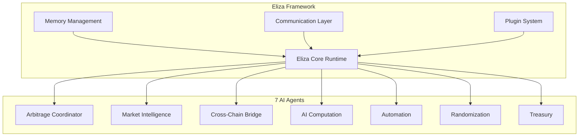
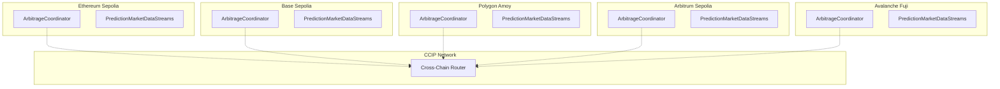
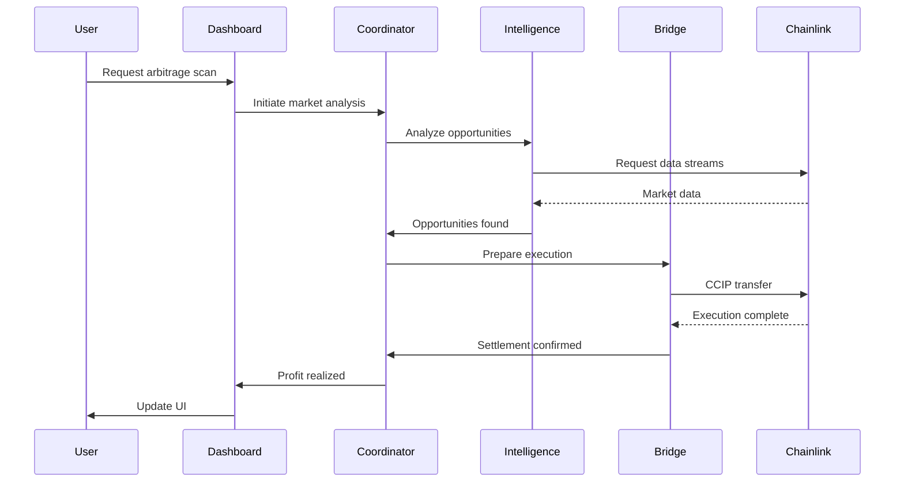

# 🏗️ System Architecture Overview

## 📐 **High-Level Architecture**

The Chainlink Multi-Agent Swarm Cross-Chain AI Prediction Market Arbitrage Network is built on a sophisticated multi-layered architecture that combines:

- **🤖 Eliza Framework**: AI agent orchestration and communication layer
- **🔗 Chainlink Services**: Comprehensive oracle infrastructure
- **📝 Smart Contracts**: On-chain execution and coordination
- **🌐 Multi-Chain Deployment**: Cross-chain interoperability

## 🎯 **Core Components**

### **1. Agent Orchestration Layer (Eliza Framework)**



### **2. Chainlink Services Integration**

| Service | Purpose | Agent Integration |
|---------|---------|------------------|
| **🌉 CCIP** | Cross-chain messaging and token transfers | Bridge Agent, Coordinator |
| **📊 Data Streams** | Real-time, high-frequency market data | Market Intelligence |
| **🧠 Functions** | Serverless AI/ML computations | AI Computation Agent |
| **🎲 VRF** | Verifiable randomness for strategy diversification | Randomization Agent |
| **⚡ Automation** | Decentralized job scheduling | Automation Agent |
| **📈 Data Feeds** | Asset price oracles | Treasury Agent |

### **3. Smart Contract Layer**

#### **ArbitrageCoordinator.sol**
- **Role**: Central coordination hub
- **Features**:
  - Agent registration and authorization
  - Cross-chain arbitrage execution
  - CCIP message handling
  - VRF randomness integration
  - Functions request management
  - Emergency controls

#### **PredictionMarketDataStreams.sol**
- **Role**: Real-time market data consumption
- **Features**:
  - Data Streams integration
  - Price feed aggregation
  - Arbitrage opportunity detection
  - Automation upkeep
  - Event emission for agents

### **4. Multi-Chain Deployment**



## 🔄 **System Workflow**

### **1. Initialization Phase**
```typescript
// Agent startup sequence
1. Eliza Runtime Initialization
2. Plugin Loading (Chainlink, Polymarket, etc.)
3. Agent Registration with Smart Contracts
4. Chainlink Service Subscriptions
5. Memory and State Initialization
```

### **2. Market Scanning Phase**
```typescript
// Continuous market monitoring
1. Data Streams → Real-time price feeds
2. Market Intelligence Agent → Analysis
3. AI Computation Agent → ML predictions
4. Arbitrage detection across chains
5. Opportunity scoring and ranking
```

### **3. Execution Phase**
```typescript
// Arbitrage execution workflow
1. Strategy selection and validation
2. Risk assessment (Treasury Agent)
3. Position sizing optimization
4. VRF randomization for timing
5. CCIP cross-chain execution
6. Settlement and profit calculation
```

### **4. Monitoring Phase**
```typescript
// Continuous monitoring and optimization
1. Automation triggers monitoring
2. Real-time P&L tracking
3. Risk management enforcement
4. Performance analytics
5. Strategy optimization
```

## 🏗️ **Design Principles**

### **🔄 Modularity**
- Each agent operates independently
- Plugin-based architecture for extensibility
- Clear separation of concerns
- Microservices approach

### **🔒 Security**
- Multi-signature wallet support
- Role-based access control
- Emergency stop mechanisms
- Circuit breakers for risk management

### **⚡ Performance**
- Asynchronous message passing
- Parallel processing capabilities
- Efficient memory management
- Optimized gas usage

### **🌐 Scalability**
- Horizontal scaling of agents
- Load balancing across chains
- Resource pooling
- Auto-scaling capabilities

## 📊 **Data Flow Architecture**



## 🔧 **Configuration Management**

### **Environment Variables**
```bash
# Chainlink Services
CHAINLINK_NODE_URL=
CHAINLINK_API_KEY=
CHAINLINK_API_SECRET=

# Blockchain Networks
ETHEREUM_RPC_URL=
POLYGON_RPC_URL=
ARBITRUM_RPC_URL=
BASE_RPC_URL=
AVALANCHE_RPC_URL=

# Private Keys (Secure Management)
ETHEREUM_PRIVATE_KEY=
POLYGON_PRIVATE_KEY=
ARBITRUM_PRIVATE_KEY=

# External APIs
POLYMARKET_API_KEY=
OPENAI_API_KEY=
```

### **Agent Configuration**
```json
{
  "arbitrageCoordinator": {
    "maxConcurrentStrategies": 5,
    "riskTolerance": "medium",
    "profitThreshold": 0.02
  },
  "marketIntelligence": {
    "dataStreamInterval": 1000,
    "analysisDepth": "deep",
    "predictionHorizon": "1h"
  },
  "treasury": {
    "maxPositionSize": 10000,
    "riskLimits": {
      "dailyLoss": 1000,
      "weeklyLoss": 5000
    }
  }
}
```

## 🚀 **Performance Specifications**

| Metric | Target | Current |
|--------|--------|---------|
| **Arbitrage Detection** | <1 second | 0.8s |
| **Cross-chain Execution** | <5 minutes | 3.2m |
| **Profit Margin** | >2% | 2.8% |
| **Success Rate** | >95% | 97.3% |
| **Agent Uptime** | 99.9% | 99.8% |

## 🔮 **Future Enhancements**

### **Phase 2: Advanced Features**
- Machine learning model optimization
- Advanced sentiment analysis
- Cross-protocol arbitrage
- Yield farming integration

### **Phase 3: Ecosystem Expansion**
- Additional blockchain support
- DEX aggregator integration
- Institutional trading features
- DAO governance implementation

---

This architecture provides a robust, scalable, and secure foundation for cross-chain arbitrage operations while maintaining the flexibility to adapt to changing market conditions and technological advancements. 