# 🔗 Chainlink Services Overview

## 🌐 **Introduction**

Our Cross-Chain AI Prediction Market Arbitrage Network leverages Chainlink's comprehensive service ecosystem to enable secure, reliable, and decentralized arbitrage operations across multiple blockchains. Each service provides critical infrastructure for different aspects of the system.

## 🏗️ **Service Architecture**

```mermaid
graph TB
    subgraph "Chainlink Service Ecosystem"
        subgraph "Data Layer"
            DS[Data Streams<br/>📊 Real-time Market Data]
            DF[Data Feeds<br/>📈 Price Oracles]
        end
        
        subgraph "Computation Layer"
            FUNC[Functions<br/>🧠 Serverless Compute]
            VRF[VRF<br/>🎲 Verifiable Randomness]
        end
        
        subgraph "Automation Layer"
            AUTO[Automation<br/>⚡ Decentralized Scheduling]
            CCIP[CCIP<br/>🌉 Cross-Chain Interoperability]
        end
    end
    
    subgraph "AI Agents"
        MI[Market Intelligence Agent]
        AC[Arbitrage Coordinator]
        CB[Cross-Chain Bridge Agent]
        AI[AI Computation Agent]
        AU[Automation Agent]
        RA[Randomization Agent]
        TA[Treasury Agent]
    end
    
    subgraph "Smart Contracts"
        COORD[ArbitrageCoordinator.sol]
        STREAMS[PredictionMarketDataStreams.sol]
    end
    
    %% Data Layer Connections
    DS --> MI
    DS --> STREAMS
    DF --> TA
    DF --> COORD
    
    %% Computation Layer Connections
    FUNC --> AI
    FUNC --> COORD
    VRF --> RA
    VRF --> COORD
    
    %% Automation Layer Connections
    AUTO --> AU
    AUTO --> STREAMS
    CCIP --> CB
    CCIP --> COORD
    
    %% Agent to Contract Connections
    MI --> STREAMS
    AC --> COORD
    CB --> COORD
    AI --> COORD
    AU --> COORD
    RA --> COORD
    TA --> COORD
    
    classDef dataService fill:#e3f2fd,stroke:#1976d2,stroke-width:2px
    classDef computeService fill:#f3e5f5,stroke:#7b1fa2,stroke-width:2px
    classDef automationService fill:#e8f5e8,stroke:#388e3c,stroke-width:2px
    classDef agent fill:#fff3e0,stroke:#f57c00,stroke-width:2px
    classDef contract fill:#fce4ec,stroke:#c2185b,stroke-width:2px
    
    class DS,DF dataService
    class FUNC,VRF computeService
    class AUTO,CCIP automationService
    class MI,AC,CB,AI,AU,RA,TA agent
    class COORD,STREAMS contract
```



## 📊 **Data Services**

### **1. Chainlink Data Streams**

**Purpose**: Real-time, high-frequency market data for arbitrage detection

#### **Key Features:**
- **⚡ Sub-second Updates**: Near real-time price feeds
- **🔒 Cryptographic Verification**: Tamper-proof data integrity
- **📊 High Throughput**: Thousands of data points per second
- **🎯 Low Latency**: Minimal delay for arbitrage opportunities

#### **Integration:**
```solidity
contract PredictionMarketDataStreams {
    struct StreamData {
        bytes32 feedId;
        uint256 price;
        uint256 timestamp;
        bytes signature;
    }
    
    function updatePricesWithVerifiedReports(
        bytes[] memory verifiedReports
    ) external {
        for (uint i = 0; i < verifiedReports.length; i++) {
            StreamData memory data = abi.decode(verifiedReports[i], (StreamData));
            _verifyAndUpdatePrice(data);
        }
    }
}
```

#### **Market Coverage:**
| Market Type | Feed IDs | Update Frequency |
|------------|----------|------------------|
| **Crypto Spot** | BTC/USD, ETH/USD, etc. | 1-5 seconds |
| **Prediction Markets** | Custom feeds | 10-30 seconds |
| **Cross-Chain Rates** | Multi-chain pricing | 5-15 seconds |

#### **Agent Integration:**
- **Market Intelligence Agent**: Consumes feeds for trend analysis
- **AI Computation Agent**: Uses data for ML model training
- **Arbitrage Coordinator**: Monitors for profit opportunities

### **2. Chainlink Data Feeds**

**Purpose**: Reliable price oracles for portfolio valuation and risk management

#### **Key Features:**
- **🏦 Institutional Grade**: Bank-level reliability
- **🌐 Wide Coverage**: 1000+ price pairs across multiple chains
- **⚖️ Decentralized**: Multiple data sources and nodes
- **🔍 Transparent**: On-chain verification

#### **Integration:**
```solidity
import "@chainlink/contracts/src/v0.8/interfaces/AggregatorV3Interface.sol";

contract TreasuryManager {
    mapping(address => AggregatorV3Interface) public priceFeeds;
    
    function getAssetPrice(address asset) external view returns (uint256) {
        AggregatorV3Interface priceFeed = priceFeeds[asset];
        (, int256 price, , , ) = priceFeed.latestRoundData();
        return uint256(price);
    }
}
```

#### **Supported Assets:**
- **Major Cryptocurrencies**: BTC, ETH, LINK, USDC, USDT
- **Traditional Assets**: Gold, Silver, Oil, Forex pairs
- **DeFi Tokens**: UNI, AAVE, COMP, etc.

## 🧠 **Computation Services**

### **1. Chainlink Functions**

**Purpose**: Serverless compute for AI/ML model execution and complex market analysis

#### **Key Features:**
- **☁️ Serverless Architecture**: No infrastructure management
- **🔐 Secure Execution**: Tamper-proof computation environment
- **📈 Scalable**: Automatic scaling based on demand
- **🌐 External API Access**: Connect to any web API

#### **Integration:**
```solidity
contract ArbitrageCoordinator is FunctionsClient {
    using FunctionsRequest for FunctionsRequest.Request;
    
    function requestMarketAnalysis(
        string memory marketId,
        string[] memory parameters
    ) external returns (bytes32 requestId) {
        FunctionsRequest.Request memory req;
        req.initializeRequestForInlineJavaScript(
            "const marketData = await fetch(`https://api.polymarket.com/markets/${args[0]}`); return marketData.json();"
        );
        req.setArgs([marketId]);
        
        requestId = _sendRequest(req.encodeCBOR(), s_subscriptionId, 100000, s_donId);
        return requestId;
    }
    
    function fulfillRequest(
        bytes32 requestId,
        bytes memory response,
        bytes memory err
    ) internal override {
        // Process AI/ML analysis results
        _processMarketAnalysis(requestId, response);
    }
}
```

#### **Use Cases:**
| Function | Purpose | Agent |
|----------|---------|-------|
| **Market Analysis** | Analyze prediction market trends | Market Intelligence |
| **ML Predictions** | Generate price forecasts | AI Computation |
| **Risk Assessment** | Calculate position risks | Treasury Agent |
| **Sentiment Analysis** | Process social media data | Market Intelligence |

#### **JavaScript Examples:**

```javascript
// Market Sentiment Analysis
const analyzeSentiment = `
  const newsData = await fetch('https://newsapi.org/v2/everything?q=bitcoin');
  const sentiment = await fetch('https://api.sentiment.com/analyze', {
    method: 'POST',
    body: JSON.stringify({text: newsData.articles})
  });
  return sentiment.score;
`;

// Cross-Chain Price Comparison
const compareChainPrices = `
  const ethPrice = await fetch('https://api.coingecko.com/api/v3/simple/price?ids=ethereum&vs_currencies=usd');
  const polyPrice = await fetch('https://api.coingecko.com/api/v3/simple/price?ids=polygon&vs_currencies=usd');
  return {
    ethereum: ethPrice.ethereum.usd,
    polygon: polyPrice.polygon.usd,
    arbitrage: Math.abs(ethPrice.ethereum.usd - polyPrice.polygon.usd) / ethPrice.ethereum.usd
  };
`;
```

### **2. Chainlink VRF (Verifiable Random Function)**

**Purpose**: Verifiable randomness for strategy diversification and MEV protection

#### **Key Features:**
- **🎲 Cryptographically Secure**: Tamper-proof randomness
- **✅ Publicly Verifiable**: Anyone can verify randomness
- **⚡ Fast Generation**: Sub-minute response times
- **🔒 Manipulation Resistant**: Protected against exploitation

#### **Integration:**
```solidity
contract RandomizationManager is VRFConsumerBaseV2Plus {
    using VRFV2PlusClient for VRFV2PlusClient.RandomWordsRequest;
    
    struct RandomnessRequest {
        address requester;
        uint256 strategySeed;
        bool fulfilled;
    }
    
    mapping(uint256 => RandomnessRequest) public requests;
    
    function requestStrategyRandomization(
        uint256 strategySeed
    ) external returns (uint256 requestId) {
        VRFV2PlusClient.RandomWordsRequest memory req = VRFV2PlusClient.RandomWordsRequest({
            keyHash: s_keyHash,
            subId: s_subscriptionId,
            requestConfirmations: 3,
            callbackGasLimit: 100000,
            numWords: 3
        });
        
        requestId = s_vrfCoordinator.requestRandomWords(req);
        requests[requestId] = RandomnessRequest({
            requester: msg.sender,
            strategySeed: strategySeed,
            fulfilled: false
        });
        
        return requestId;
    }
    
    function fulfillRandomWords(
        uint256 requestId,
        uint256[] calldata randomWords
    ) internal override {
        RandomnessRequest storage request = requests[requestId];
        request.fulfilled = true;
        
        // Use randomness for strategy diversification
        _diversifyStrategy(request.strategySeed, randomWords);
    }
}
```

#### **Randomization Applications:**
- **⏰ Execution Timing**: Random delays to avoid MEV
- **🎯 Strategy Selection**: Diversify across multiple strategies
- **📊 Portfolio Rebalancing**: Random intervals for rebalancing
- **🧪 A/B Testing**: Random strategy assignment

## ⚡ **Automation Services**

### **1. Chainlink Automation**

**Purpose**: Decentralized job scheduling and automated strategy execution

#### **Key Features:**
- **🔄 Decentralized Execution**: No single point of failure
- **⚡ Gas Efficient**: Optimized for cost-effective operations
- **📊 Conditional Logic**: Smart trigger conditions
- **🛡️ Reliable**: 99.9% uptime guarantee

#### **Integration:**
```solidity
contract AutomatedArbitrage is AutomationCompatibleInterface {
    uint256 public lastUpdateTime;
    uint256 public updateInterval = 60; // 1 minute
    
    function checkUpkeep(
        bytes calldata /* checkData */
    ) external view returns (bool upkeepNeeded, bytes memory performData) {
        upkeepNeeded = (block.timestamp - lastUpdateTime) > updateInterval;
        performData = abi.encode(block.timestamp);
    }
    
    function performUpkeep(bytes calldata performData) external {
        uint256 currentTime = abi.decode(performData, (uint256));
        lastUpdateTime = currentTime;
        
        // Execute automated arbitrage checks
        _scanForOpportunities();
        _executeQualifiedStrategies();
        _rebalancePortfolio();
    }
}
```

#### **Automation Jobs:**
| Job Type | Frequency | Purpose | Trigger |
|----------|-----------|---------|---------|
| **Market Scanning** | Every 30s | Find opportunities | Time-based |
| **Position Monitoring** | Every 60s | Track P&L | Time-based |
| **Risk Management** | Every 5m | Check limits | Conditional |
| **Portfolio Rebalancing** | Daily | Optimize allocation | Time + Conditional |

### **2. Chainlink CCIP (Cross-Chain Interoperability Protocol)**

**Purpose**: Secure cross-chain message passing and token transfers

#### **Key Features:**
- **🔒 Security First**: Bank-level security for cross-chain operations
- **🌐 Universal Connectivity**: Connect any blockchain
- **💰 Token Transfers**: Native and custom token support
- **📨 Message Passing**: Arbitrary data transmission

#### **Integration:**
```solidity
contract CrossChainArbitrage is IRouterClient, CCIPReceiver {
    using Client for Client.EVM2AnyMessage;
    
    function executeCrossChainArbitrage(
        uint64 destinationChainSelector,
        address receiver,
        string memory marketId,
        uint256 amount
    ) external returns (bytes32 messageId) {
        Client.EVM2AnyMessage memory evm2AnyMessage = Client.EVM2AnyMessage({
            receiver: abi.encode(receiver),
            data: abi.encode(marketId, amount, msg.sender),
            tokenAmounts: new Client.EVMTokenAmount[](0),
            extraArgs: Client._argsToBytes(Client.EVMExtraArgsV1({gasLimit: 200_000})),
            feeToken: i_linkToken
        });
        
        uint256 fees = IRouterClient(i_ccipRouter).getFee(destinationChainSelector, evm2AnyMessage);
        
        IERC20(i_linkToken).transferFrom(msg.sender, address(this), fees);
        IERC20(i_linkToken).approve(i_ccipRouter, fees);
        
        messageId = IRouterClient(i_ccipRouter).ccipSend(destinationChainSelector, evm2AnyMessage);
        
        emit ArbitrageInitiated(messageId, destinationChainSelector, marketId, amount);
        return messageId;
    }
    
    function _ccipReceive(Client.Any2EVMMessage memory message) internal override {
        (string memory marketId, uint256 amount, address originalSender) = abi.decode(
            message.data,
            (string, uint256, address)
        );
        
        // Execute arbitrage on destination chain
        _executeDestinationTrade(marketId, amount, originalSender);
    }
}
```

#### **Supported Networks:**
| Network | Chain Selector | Status |
|---------|----------------|---------|
| **Ethereum Sepolia** | 16015286601757825753 | ✅ Active |
| **Base Sepolia** | 10344971235874465080 | ✅ Active |
| **Polygon Amoy** | 16281711391670634445 | ✅ Active |
| **Arbitrum Sepolia** | 3478487238524512106 | ✅ Active |
| **Avalanche Fuji** | 14767482510784806043 | ✅ Active |

#### **Cross-Chain Flows:**


## 🔧 **Service Configuration**

### **Network Configuration**

```json
{
  "chainlink": {
    "sepolia": {
      "ccipRouter": "0x0BF3dE8c5D3e8A2B34D2BEeB17ABfCeBaf363A59",
      "vrfCoordinator": "0x8103B0A8A00be2DDC778e6e7eaa21791Cd364625",
      "functionsRouter": "0xb83E47C2bC239B3bf370bc41e1459A34b41238D0",
      "automationRegistry": "0xE16Df59B887e3Caa439E0b29B42bA2e7976FD8b2",
      "linkToken": "0x779877A7B0D9E8603169DdbD7836e478b4624789"
    },
    "baseSepolia": {
      "ccipRouter": "0xD3b06cEbF099CE7DA4AcCf578aaebFDBd6e88a93",
      "vrfCoordinator": "0x4b09e658ed251bcafeebbc69c9e99b3c",
      "functionsRouter": "0xf9B8fc078197181C841c296C876945aaa425B278",
      "automationRegistry": "0xE16Df59B887e3Caa439E0b29B42bA2e7976FD8b2",
      "linkToken": "0xE4aB69C077896252FAFBD49EFD26B5D171A32410"
    }
  }
}
```

### **Subscription Management**

```typescript
// VRF Subscription Setup
const setupVRFSubscription = async () => {
  const vrfCoordinator = await ethers.getContractAt("VRFCoordinatorV2Plus", VRF_COORDINATOR);
  const subId = await vrfCoordinator.createSubscription();
  await vrfCoordinator.fundSubscription(subId, ethers.parseEther("10")); // 10 LINK
  await vrfCoordinator.addConsumer(subId, CONTRACT_ADDRESS);
};

// Functions Subscription Setup
const setupFunctionsSubscription = async () => {
  const functionsRouter = await ethers.getContractAt("FunctionsRouter", FUNCTIONS_ROUTER);
  const subId = await functionsRouter.createSubscription();
  await functionsRouter.fundSubscription(subId, ethers.parseEther("20")); // 20 LINK
  await functionsRouter.addConsumer(subId, CONTRACT_ADDRESS);
};
```

## 📊 **Performance & Monitoring**

### **Service Metrics**

| Service | Latency | Reliability | Cost (LINK) |
|---------|---------|-------------|-------------|
| **Data Streams** | <1s | 99.9% | 0.01/update |
| **Functions** | <30s | 99.8% | 0.1/request |
| **VRF** | <30s | 99.9% | 0.25/request |
| **Automation** | <60s | 99.9% | 0.05/execution |
| **CCIP** | <20m | 99.8% | 0.5-2/transfer |

### **Health Monitoring**

```typescript
interface ServiceHealth {
  dataStreams: {
    lastUpdate: number;
    updateFrequency: number;
    errorRate: number;
  };
  functions: {
    averageResponseTime: number;
    successRate: number;
    queueSize: number;
  };
  vrf: {
    averageFulfillmentTime: number;
    failureRate: number;
  };
  automation: {
    jobsExecuted: number;
    uptime: number;
  };
  ccip: {
    messagesSent: number;
    averageConfirmationTime: number;
    failureRate: number;
  };
}
```

## 🔮 **Future Integrations**

### **Upcoming Services**
- **🔮 Chainlink Proof of Reserve**: Asset backing verification
- **🌡️ Weather Data**: Climate-based prediction markets
- **📈 Sports Data**: Sports betting arbitrage
- **🏛️ Economic Data**: Macro-economic indicators

### **Enhanced Features**
- **📊 Advanced Analytics**: ML-powered market insights
- **🔄 Cross-Protocol Bridges**: Connect to more ecosystems
- **⚡ Lightning Fast Execution**: Sub-second trade execution
- **🛡️ Enhanced Security**: Additional security layers

---

This comprehensive Chainlink service integration provides the robust, decentralized infrastructure needed for sophisticated cross-chain arbitrage operations while maintaining the highest standards of security and reliability. 