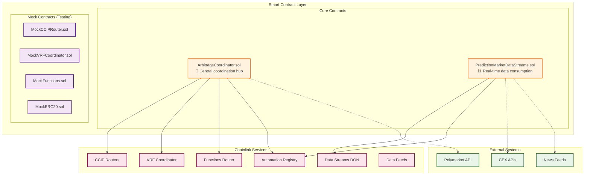

# 📝 Smart Contracts Overview

## 📄 **Introduction**

The smart contract layer serves as the on-chain foundation for our Cross-Chain AI Prediction Market Arbitrage Network. These contracts integrate deeply with Chainlink's comprehensive service ecosystem to enable autonomous, multi-chain arbitrage operations.

## 🏗️ **Contract Architecture**



## 🎯 **Core Contracts**

### **1. ArbitrageCoordinator.sol**

The central coordination hub that orchestrates all arbitrage operations and integrates with multiple Chainlink services.

#### **Key Features:**
- **🤖 Agent Management**: Registration and authorization of AI agents
- **🌉 Cross-Chain Coordination**: CCIP integration for multi-chain operations
- **🧠 AI/ML Integration**: Chainlink Functions for serverless computations
- **🎲 Strategy Randomization**: VRF integration for MEV protection
- **⚡ Automated Execution**: Chainlink Automation for scheduled operations
- **🔐 Security Controls**: Emergency stops and risk management

#### **Core Functions:**

```solidity
// Agent Management
function registerAgent(address agent, string memory role) external onlyOwner
function authorizeAgent(address agent) external onlyOwner
function revokeAgent(address agent) external onlyOwner

// Market Analysis
function requestMarketData(string memory marketId, uint256 chainId) external onlyAuthorizedAgent
function requestPrediction(string memory marketId, uint256 timeHorizon) external onlyAuthorizedAgent

// Strategy Execution
function executeArbitrage(
    string memory marketId,
    uint256 amount,
    uint64 targetChain
) external onlyAuthorizedAgent returns (bytes32 requestId)

// Cross-Chain Operations
function ccipSend(
    uint64 destinationChainSelector,
    Client.EVM2AnyMessage memory message
) external onlyAuthorizedAgent returns (bytes32 messageId)

// Randomization
function requestRandomness(
    uint32 numWords,
    uint256 callbackGasLimit
) external onlyAuthorizedAgent returns (uint256 requestId)

// Emergency Controls
function emergencyStop() external onlyOwner
function withdrawProfits(uint256 amount, address token) external
```

#### **Integration Points:**

| Chainlink Service | Integration Method | Purpose |
|------------------|-------------------|---------|
| **CCIP** | `ccipSend()`, `ccipReceive()` | Cross-chain message passing and token transfers |
| **Functions** | `sendRequest()`, `fulfillRequest()` | AI/ML model execution and market analysis |
| **VRF** | `requestRandomWords()`, `fulfillRandomWords()` | Strategy randomization and timing |
| **Automation** | `checkUpkeep()`, `performUpkeep()` | Automated strategy execution |

### **2. PredictionMarketDataStreams.sol**

Specialized contract for consuming real-time market data via Chainlink Data Streams and detecting arbitrage opportunities.

#### **Key Features:**
- **📊 Data Streams Integration**: Real-time, high-frequency market data consumption
- **🔍 Arbitrage Detection**: Automated opportunity identification
- **⚡ Automation Integration**: Scheduled data updates and monitoring
- **📈 Price Aggregation**: Multi-feed price consolidation
- **🎯 Event Emission**: Real-time notifications to AI agents

#### **Core Functions:**

```solidity
// Data Streams Integration
function updatePricesWithVerifiedReports(
    bytes[] memory verifiedReports
) external onlyAuthorizedAgent

function getLatestPrice(bytes32 feedId) external view returns (uint256 price, uint256 timestamp)

// Arbitrage Detection
function checkArbitrageOpportunities() external view returns (bool upkeepNeeded, bytes memory performData)

function detectCrossChainArbitrage(
    bytes32[] memory feedIds,
    uint256[] memory chains
) external view returns (ArbitrageOpportunity[] memory opportunities)

// Automation Integration
function setUpkeepInterval(uint256 newInterval) external onlyOwner
function performUpkeep(bytes calldata performData) external
```

#### **Data Structures:**

```solidity
struct ArbitrageOpportunity {
    bytes32 marketId;
    uint256 sourceChain;
    uint256 targetChain;
    uint256 sourcePrice;
    uint256 targetPrice;
    uint256 profitMargin;
    uint256 timestamp;
    bool isActive;
}

struct MarketData {
    bytes32 feedId;
    uint256 price;
    uint256 timestamp;
    uint256 chainId;
    bytes32 marketIdentifier;
}

struct VerifiedReport {
    bytes32 feedId;
    uint32 validFromTimestamp;
    uint32 observationsTimestamp;
    uint192 nativeFee;
    uint192 linkFee;
    uint32 expiresAt;
    int192 price;
}
```

## 🧪 **Mock Contracts (Testing)**

### **Mock Contract Suite**

Our testing infrastructure includes comprehensive mock contracts that simulate Chainlink services:

| Mock Contract | Simulates | Key Functions |
|--------------|-----------|---------------|
| **MockCCIPRouter** | CCIP Router | `ccipSend()`, `routeMessage()`, fee calculation |
| **MockVRFCoordinator** | VRF Coordinator | `requestRandomWords()`, `fulfillRandomWords()` |
| **MockFunctions** | Functions Router | `sendRequest()`, `fulfillRequest()` |
| **MockERC20** | Standard tokens | `transfer()`, `approve()`, `mint()` |

#### **MockCCIPRouter.sol**

```solidity
contract MockCCIPRouter {
    struct CCIPMessage {
        uint64 destinationChainSelector;
        address receiver;
        bytes data;
        Client.EVMTokenAmount[] tokenAmounts;
        address feeToken;
        bytes extraArgs;
    }
    
    function ccipSend(
        uint64 destinationChainSelector,
        Client.EVM2AnyMessage memory message
    ) external payable returns (bytes32 messageId) {
        // Mock implementation for testing
        messageId = keccak256(abi.encode(message, block.timestamp));
        
        emit MockMessageSent(messageId, destinationChainSelector, message.receiver);
        return messageId;
    }
    
    function getFee(
        uint64 destinationChainSelector,
        Client.EVM2AnyMessage memory message
    ) external pure returns (uint256 fee) {
        return 0.001 ether; // Mock fee
    }
}
```

## 🚀 **Deployment Configuration**

### **Multi-Chain Deployment**

```json
{
  "networks": {
    "sepolia": {
      "chainId": 11155111,
      "contracts": {
        "ArbitrageCoordinator": "0x1234...ABCD",
        "PredictionMarketDataStreams": "0x5678...EFGH"
      },
      "chainlink": {
        "ccipRouter": "0xa0b86a33e6ba3b1c4e5d0e2fb1c1fb1e98b8d1e5",
        "vrfCoordinator": "0x8103B0A8A00be2DDC778e6e7eaa21791Cd364625",
        "functionsRouter": "0xb83E47C2bC239B3bf370bc41e1459A34b41238D0"
      }
    },
    "baseSepolia": {
      "chainId": 84532,
      "contracts": {
        "ArbitrageCoordinator": "0x9012...IJKL",
        "PredictionMarketDataStreams": "0x3456...MNOP"
      },
      "chainlink": {
        "ccipRouter": "0xD3b06cEbF099CE7DA4AcCf578aaebFDBd6e88a93",
        "vrfCoordinator": "0x4b09e658ed251bcafeebbc69c9e99b3c",
        "functionsRouter": "0xf9B8fc078197181C841c296C876945aaa425B278"
      }
    },
    "polygonAmoy": {
      "chainId": 80002,
      "contracts": {
        "ArbitrageCoordinator": "0x7890...QRST",
        "PredictionMarketDataStreams": "0x1234...UVWX"
      },
      "chainlink": {
        "ccipRouter": "0x9C32fCB86BF0f4a1A8921a9Fe46de3198bb884B2",
        "vrfCoordinator": "0x343300b5d84D444B2ADc9116FEF1bED02BE49Cf2",
        "functionsRouter": "0xC22a79eBA640940ABB6dF0f7982cc119578E11De"
      }
    }
  }
}
```

### **Deployment Scripts**

```typescript
// deploy-all.ts
async function deployArbitrageNetwork() {
  const [deployer] = await ethers.getSigners();
  
  // Deploy ArbitrageCoordinator
  const ArbitrageCoordinator = await ethers.getContractFactory("ArbitrageCoordinator");
  const coordinator = await ArbitrageCoordinator.deploy(
    process.env.CCIP_ROUTER,
    process.env.VRF_COORDINATOR,
    process.env.FUNCTIONS_ROUTER,
    process.env.LINK_TOKEN
  );
  
  // Deploy PredictionMarketDataStreams
  const PredictionMarketDataStreams = await ethers.getContractFactory("PredictionMarketDataStreams");
  const dataStreams = await PredictionMarketDataStreams.deploy(
    process.env.AUTOMATION_REGISTRY,
    coordinator.address
  );
  
  // Configure integrations
  await coordinator.setPredictionMarketContract(dataStreams.address);
  await dataStreams.setCoordinator(coordinator.address);
  
  console.log("ArbitrageCoordinator deployed to:", coordinator.address);
  console.log("PredictionMarketDataStreams deployed to:", dataStreams.address);
}
```

## 🔐 **Security Features**

### **Access Control**

```solidity
// Role-based access control
bytes32 public constant AGENT_ROLE = keccak256("AGENT_ROLE");
bytes32 public constant OPERATOR_ROLE = keccak256("OPERATOR_ROLE");
bytes32 public constant EMERGENCY_ROLE = keccak256("EMERGENCY_ROLE");

modifier onlyAuthorizedAgent() {
    require(hasRole(AGENT_ROLE, msg.sender), "Unauthorized agent");
    _;
}

modifier onlyOperator() {
    require(hasRole(OPERATOR_ROLE, msg.sender), "Unauthorized operator");
    _;
}

modifier whenNotPaused() {
    require(!paused, "Contract is paused");
    _;
}
```

### **Emergency Controls**

```solidity
// Emergency stop mechanism
bool public paused = false;

function emergencyStop() external onlyRole(EMERGENCY_ROLE) {
    paused = true;
    emit EmergencyStop(msg.sender, block.timestamp);
}

function resume() external onlyOwner {
    paused = false;
    emit ContractResumed(msg.sender, block.timestamp);
}

// Circuit breaker for large losses
uint256 public maxDailyLoss = 10000 * 10**18; // 10,000 USD
mapping(uint256 => uint256) public dailyLosses; // day => loss amount

function checkCircuitBreaker(uint256 lossAmount) internal {
    uint256 today = block.timestamp / 1 days;
    dailyLosses[today] += lossAmount;
    
    if (dailyLosses[today] > maxDailyLoss) {
        paused = true;
        emit CircuitBreakerTriggered(lossAmount, dailyLosses[today]);
    }
}
```

### **Risk Management**

```solidity
struct RiskLimits {
    uint256 maxPositionSize;      // Maximum position size per trade
    uint256 maxDailyVolume;       // Maximum daily trading volume
    uint256 maxConcurrentTrades;  // Maximum concurrent trades
    uint256 minProfitMargin;      // Minimum profit margin required
}

mapping(address => RiskLimits) public agentRiskLimits;

function validateTrade(
    address agent,
    uint256 amount,
    uint256 profitMargin
) internal view returns (bool) {
    RiskLimits memory limits = agentRiskLimits[agent];
    
    require(amount <= limits.maxPositionSize, "Position too large");
    require(profitMargin >= limits.minProfitMargin, "Insufficient profit margin");
    require(getActiveTrades(agent) < limits.maxConcurrentTrades, "Too many concurrent trades");
    
    return true;
}
```

## 📊 **Events & Monitoring**

### **Key Events**

```solidity
// Agent management events
event AgentRegistered(address indexed agent, string role, uint256 timestamp);
event AgentAuthorized(address indexed agent, uint256 timestamp);
event AgentRevoked(address indexed agent, uint256 timestamp);

// Arbitrage events
event ArbitrageOpportunityDetected(
    bytes32 indexed marketId,
    uint256 sourceChain,
    uint256 targetChain,
    uint256 profitMargin,
    uint256 timestamp
);

event ArbitrageExecuted(
    bytes32 indexed requestId,
    address indexed agent,
    string marketId,
    uint256 amount,
    uint256 expectedProfit,
    uint256 timestamp
);

// Cross-chain events
event CCIPMessageSent(
    bytes32 indexed messageId,
    uint64 destinationChain,
    address receiver,
    uint256 timestamp
);

event CCIPMessageReceived(
    bytes32 indexed messageId,
    uint64 sourceChain,
    address sender,
    uint256 timestamp
);

// Emergency events
event EmergencyStop(address indexed operator, uint256 timestamp);
event CircuitBreakerTriggered(uint256 lossAmount, uint256 totalDailyLoss);
```

### **Performance Monitoring**

```solidity
struct ContractMetrics {
    uint256 totalArbitrageExecutions;
    uint256 totalProfitGenerated;
    uint256 totalGasUsed;
    uint256 successfulTrades;
    uint256 failedTrades;
    uint256 averageExecutionTime;
}

ContractMetrics public metrics;

function updateMetrics(
    bool success,
    uint256 profit,
    uint256 gasUsed,
    uint256 executionTime
) internal {
    metrics.totalArbitrageExecutions++;
    metrics.totalGasUsed += gasUsed;
    
    if (success) {
        metrics.successfulTrades++;
        metrics.totalProfitGenerated += profit;
    } else {
        metrics.failedTrades++;
    }
    
    // Update average execution time
    metrics.averageExecutionTime = (
        (metrics.averageExecutionTime * (metrics.totalArbitrageExecutions - 1)) + executionTime
    ) / metrics.totalArbitrageExecutions;
}
```

## 🔧 **Gas Optimization**

### **Optimization Strategies**

- **Batch Operations**: Group multiple operations to reduce transaction costs
- **Storage Optimization**: Use packed structs and efficient data types
- **Event Optimization**: Indexed parameters for efficient filtering
- **Function Modifiers**: Reusable validation logic
- **Assembly Optimization**: Critical path optimizations

```solidity
// Batch processing for efficiency
function batchExecuteArbitrage(
    ArbitrageRequest[] memory requests
) external onlyAuthorizedAgent {
    for (uint i = 0; i < requests.length; i++) {
        _executeArbitrage(requests[i]);
    }
}

// Packed structs for storage efficiency
struct PackedArbitrageData {
    uint128 amount;      // Sufficient for most amounts
    uint64 timestamp;    // Unix timestamp
    uint32 chainId;      // Chain identifier
    uint16 profitBps;    // Profit in basis points
    bool isActive;       // Single bit flag
}
```

---

This comprehensive smart contract architecture provides the robust, secure, and efficient foundation needed for autonomous cross-chain arbitrage operations while maintaining seamless integration with Chainlink's service ecosystem. 