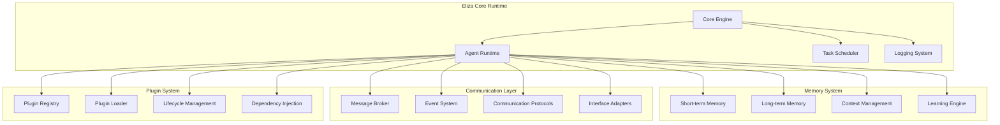

# 🤖 Eliza Framework Overview

## 📋 **Introduction**

The **Eliza Framework** serves as the foundational AI agent orchestration layer for our Cross-Chain Arbitrage Network. It provides a sophisticated runtime environment for managing multiple specialized AI agents, facilitating communication, memory management, and plugin integration.

## 🏗️ **Framework Architecture**



## 🎯 **Core Components**

### **1. Agent Runtime Environment**

The Eliza runtime provides a standardized execution environment for AI agents:

```typescript
interface ElizaAgent {
  id: string;
  name: string;
  character: Character;
  runtime: AgentRuntime;
  memory: MemoryManager;
  actions: Action[];
  evaluators: Evaluator[];
  providers: Provider[];
}
```

#### **Key Features:**
- **🔄 Async Execution**: Non-blocking agent operations
- **📊 State Management**: Persistent agent state across sessions
- **🧠 Memory Integration**: Short-term and long-term memory systems
- **🔌 Plugin Support**: Dynamic plugin loading and management
- **📡 Communication**: Inter-agent message passing

### **2. Character System**

Each agent is defined by a character configuration that determines its behavior, capabilities, and personality:

```json
{
  "name": "Arbitrage Coordinator",
  "username": "arbitrage_coordinator",
  "description": "Master orchestrator for cross-chain arbitrage opportunities",
  "character": {
    "name": "ArbitrageCoordinator",
    "username": "arbitrage_coordinator",
    "personality": [
      "Strategic and analytical",
      "Risk-aware decision maker",
      "Coordination specialist",
      "Performance optimizer"
    ],
    "bio": [
      "Expert in cross-chain arbitrage strategies",
      "Specializes in multi-agent coordination",
      "Advanced risk management capabilities",
      "Real-time market analysis"
    ],
    "lore": [
      "Born from the need for sophisticated arbitrage coordination",
      "Evolved through thousands of trading scenarios",
      "Master of Chainlink service orchestration"
    ],
    "knowledge": [
      "Cross-chain arbitrage strategies",
      "Chainlink CCIP integration",
      "Risk management protocols",
      "Agent coordination patterns"
    ],
    "messageExamples": [
      [
        {
          "user": "user",
          "content": "Find arbitrage opportunities"
        },
        {
          "user": "arbitrage_coordinator",
          "content": "Scanning prediction markets across chains... Found 3 profitable opportunities with >2% margins. Coordinating with Market Intelligence Agent for detailed analysis."
        }
      ]
    ],
    "postExamples": [
      "🎯 Arbitrage opportunity detected: BTC $100K prediction showing 3.2% margin between Ethereum and Polygon markets",
      "⚡ Executing cross-chain strategy: Estimated completion 4.2 minutes, expected profit $1,247",
      "📊 Portfolio update: 7 active positions, total unrealized PnL: +$4,832 (+12.3%)"
    ],
    "style": {
      "all": [
        "Professional and analytical",
        "Data-driven decision making",
        "Clear execution updates",
        "Risk-conscious communication"
      ],
      "chat": [
        "Concise status reports",
        "Strategic recommendations",
        "Performance metrics"
      ],
      "post": [
        "Market opportunity alerts",
        "Execution updates",
        "Performance summaries"
      ]
    },
    "adjectives": [
      "strategic",
      "analytical",
      "efficient",
      "coordinated",
      "risk-aware"
    ]
  }
}
```

### **3. Plugin Architecture**

The plugin system enables modular functionality and easy extensibility:

#### **Plugin Structure:**
```typescript
interface ElizaPlugin {
  name: string;
  description: string;
  version: string;
  actions?: Action[];
  evaluators?: Evaluator[];
  providers?: Provider[];
  clients?: Client[];
}
```

#### **Chainlink Plugins:**

| Plugin | Purpose | Key Features |
|--------|---------|--------------|
| **plugin-chainlink-ccip** | Cross-chain interoperability | Message routing, token transfers, multi-chain coordination |
| **plugin-chainlink-data-streams** | Real-time market data | High-frequency feeds, price aggregation, stream management |
| **plugin-chainlink-functions** | Serverless compute | ML model execution, custom computations, result processing |
| **plugin-chainlink-vrf** | Verifiable randomness | Strategy randomization, timing diversification, fair selection |
| **plugin-chainlink-automation** | Job scheduling | Automated triggers, recurring tasks, condition monitoring |

#### **Market Plugins:**

| Plugin | Purpose | Key Features |
|--------|---------|--------------|
| **plugin-polymarket** | Prediction market integration | Market data fetching, order management, position tracking |
| **plugin-cross-chain-arbitrage** | Arbitrage coordination | Opportunity detection, strategy management, profit calculation |

### **4. Memory Management**

Eliza provides sophisticated memory systems for maintaining context and learning:

#### **Memory Types:**

```typescript
interface MemoryManager {
  // Short-term working memory
  shortTerm: {
    currentContext: Context;
    activeGoals: Goal[];
    recentMessages: Message[];
    temporaryState: any;
  };
  
  // Long-term persistent memory
  longTerm: {
    experiences: Experience[];
    relationships: Relationship[];
    knowledge: Knowledge[];
    patterns: Pattern[];
  };
  
  // Methods
  store(memory: Memory): Promise<void>;
  retrieve(query: MemoryQuery): Promise<Memory[]>;
  update(id: string, updates: Partial<Memory>): Promise<void>;
  forget(id: string): Promise<void>;
}
```

#### **Memory Features:**
- **🔍 Semantic Search**: Vector-based memory retrieval
- **📚 Knowledge Graphs**: Relationship mapping between concepts
- **🎯 Context Awareness**: Situation-specific memory activation
- **📈 Learning**: Pattern recognition and strategy optimization

### **5. Action System**

Actions define what agents can do in response to messages or events:

```typescript
interface Action {
  name: string;
  description: string;
  similes: string[];
  examples: ActionExample[];
  handler: (runtime: AgentRuntime, message: Message, state?: State) => Promise<ActionResponse>;
  validate: (runtime: AgentRuntime, message: Message) => Promise<boolean>;
}
```

#### **Action Categories:**

| Category | Actions | Examples |
|----------|---------|-----------|
| **🔍 Analysis** | Market scanning, data analysis, prediction | `scanMarkets`, `analyzeTrends`, `generatePrediction` |
| **⚡ Execution** | Trade execution, order management, position control | `executeArbitrage`, `closePosition`, `emergencyStop` |
| **🤝 Communication** | Inter-agent messaging, user interaction | `coordinateAgents`, `sendAlert`, `updateUser` |
| **📊 Monitoring** | Performance tracking, risk assessment | `checkPortfolio`, `assessRisk`, `trackPnL` |

### **6. Evaluation System**

Evaluators determine agent responses and decision-making:

```typescript
interface Evaluator {
  name: string;
  description: string;
  similes: string[];
  examples: EvaluatorExample[];
  handler: (runtime: AgentRuntime, message: Message) => Promise<boolean>;
  validate: (runtime: AgentRuntime, message: Message) => Promise<boolean>;
}
```

#### **Evaluation Categories:**
- **🎯 Goal Achievement**: Success rate tracking
- **💰 Profit Optimization**: ROI improvement
- **⚠️ Risk Management**: Loss prevention
- **🤝 Coordination**: Multi-agent efficiency

## 🚀 **Agent Specifications**

### **1. Arbitrage Coordinator Agent**

```typescript
const arbitrageCoordinatorCharacter: Character = {
  name: "ArbitrageCoordinator",
  capabilities: [
    "Multi-chain opportunity detection",
    "Agent task delegation",
    "Risk assessment coordination",
    "Strategy optimization"
  ],
  plugins: [
    "plugin-chainlink-ccip",
    "plugin-chainlink-functions",
    "plugin-chainlink-vrf",
    "plugin-cross-chain-arbitrage"
  ],
  actions: [
    "scanMarkets",
    "coordinateExecution",
    "manageRisk",
    "optimizeStrategy"
  ]
};
```

### **2. Market Intelligence Agent**

```typescript
const marketIntelligenceCharacter: Character = {
  name: "MarketIntelligence",
  capabilities: [
    "Real-time data analysis",
    "Market sentiment analysis",
    "Trend prediction",
    "Opportunity scoring"
  ],
  plugins: [
    "plugin-chainlink-data-streams",
    "plugin-polymarket",
    "plugin-chainlink-functions"
  ],
  actions: [
    "analyzeMarkets",
    "generatePredictions",
    "trackSentiment",
    "scoreOpportunities"
  ]
};
```

### **3. Cross-Chain Bridge Agent**

```typescript
const crossChainBridgeCharacter: Character = {
  name: "CrossChainBridge",
  capabilities: [
    "CCIP transaction management",
    "Route optimization",
    "Liquidity management",
    "Cross-chain coordination"
  ],
  plugins: [
    "plugin-chainlink-ccip"
  ],
  actions: [
    "executeCCIPTransfer",
    "optimizeRoutes",
    "manageLiquidity",
    "monitorTransactions"
  ]
};
```

## 🔧 **Configuration & Setup**

### **Agent Configuration File**

```json
{
  "agents": {
    "arbitrageCoordinator": {
      "character": "./characters/arbitrage-coordinator.character.json",
      "plugins": ["ccip", "functions", "vrf", "arbitrage"],
      "settings": {
        "maxConcurrentStrategies": 5,
        "riskTolerance": "medium",
        "profitThreshold": 0.02
      }
    },
    "marketIntelligence": {
      "character": "./characters/market-intelligence.character.json",
      "plugins": ["data-streams", "polymarket", "functions"],
      "settings": {
        "analysisInterval": 1000,
        "predictionHorizon": "1h",
        "sentimentWeight": 0.3
      }
    }
  },
  "runtime": {
    "logLevel": "info",
    "memoryProvider": "redis",
    "databaseProvider": "postgresql"
  }
}
```

### **Plugin Loading**

```typescript
// Dynamic plugin loading
const loadPlugins = async (runtime: AgentRuntime) => {
  const plugins = [
    require('@plugin/chainlink-ccip'),
    require('@plugin/chainlink-data-streams'),
    require('@plugin/chainlink-functions'),
    require('@plugin/chainlink-vrf'),
    require('@plugin/chainlink-automation'),
    require('@plugin/polymarket'),
    require('@plugin/cross-chain-arbitrage')
  ];
  
  for (const plugin of plugins) {
    await runtime.loadPlugin(plugin);
  }
};
```

## 📊 **Performance & Monitoring**

### **Agent Metrics**

```typescript
interface AgentMetrics {
  performance: {
    messagesProcessed: number;
    averageResponseTime: number;
    successRate: number;
    errorRate: number;
  };
  business: {
    opportunitiesDetected: number;
    strategiesExecuted: number;
    profitGenerated: number;
    riskManaged: number;
  };
  system: {
    memoryUsage: number;
    cpuUsage: number;
    networkLatency: number;
    uptime: number;
  };
}
```

### **Health Checks**

```typescript
const healthCheck = async (agent: ElizaAgent): Promise<HealthStatus> => {
  return {
    status: 'healthy',
    uptime: agent.getUptime(),
    memory: agent.getMemoryUsage(),
    lastActivity: agent.getLastActivity(),
    errors: agent.getRecentErrors(),
    performance: agent.getPerformanceMetrics()
  };
};
```

## 🔮 **Advanced Features**

### **Machine Learning Integration**

```typescript
interface MLCapabilities {
  predictionModels: {
    marketTrends: MLModel;
    riskAssessment: MLModel;
    optimalTiming: MLModel;
  };
  reinforcementLearning: {
    strategyOptimization: RLAgent;
    riskManagement: RLAgent;
  };
  naturalLanguageProcessing: {
    sentimentAnalysis: NLPModel;
    newsAnalysis: NLPModel;
  };
}
```

### **Advanced Memory Systems**

```typescript
interface AdvancedMemory {
  episodicMemory: Episode[];
  proceduralMemory: Procedure[];
  semanticMemory: Concept[];
  workingMemory: WorkingMemoryItem[];
  
  // Advanced retrieval
  similaritySearch(query: string, k: number): Promise<Memory[]>;
  temporalQuery(timeRange: TimeRange): Promise<Memory[]>;
  conceptualReasoning(concepts: Concept[]): Promise<Inference[]>;
}
```

---

The Eliza Framework provides the robust foundation needed for sophisticated AI agent coordination in our cross-chain arbitrage system, enabling scalable, intelligent, and autonomous trading operations. 