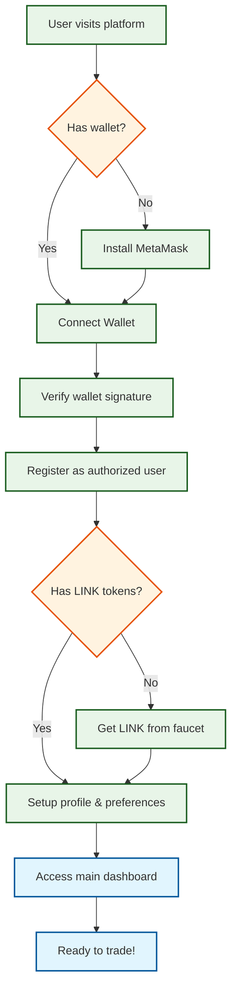
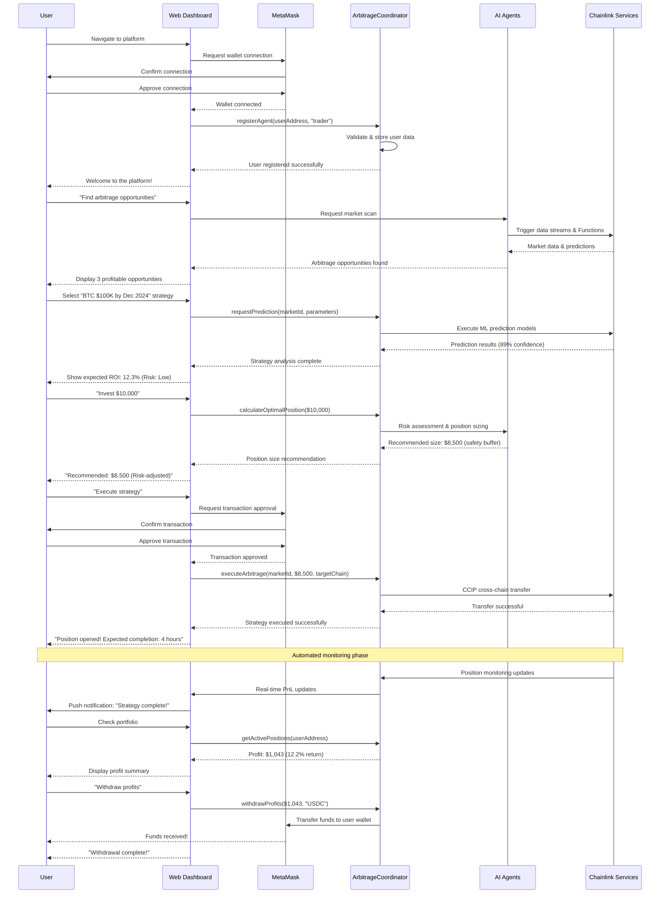
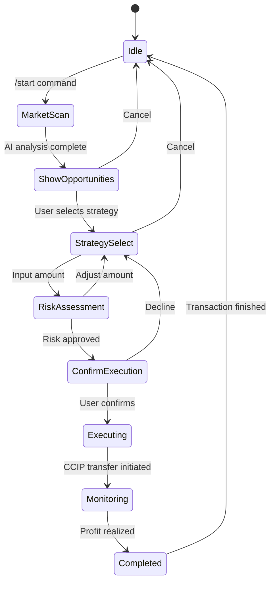
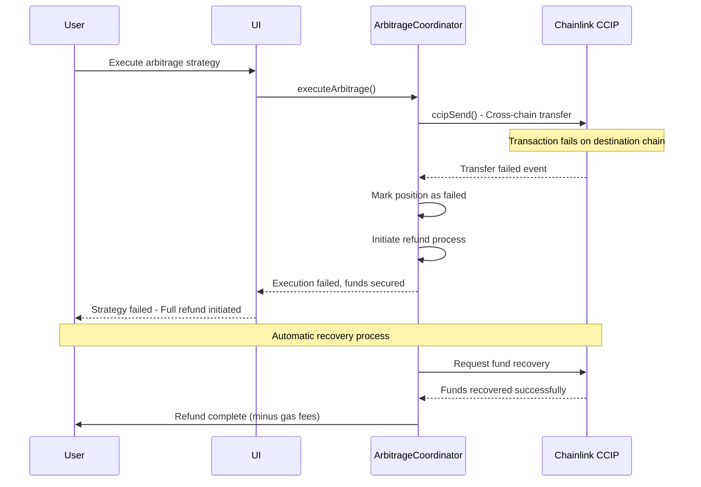
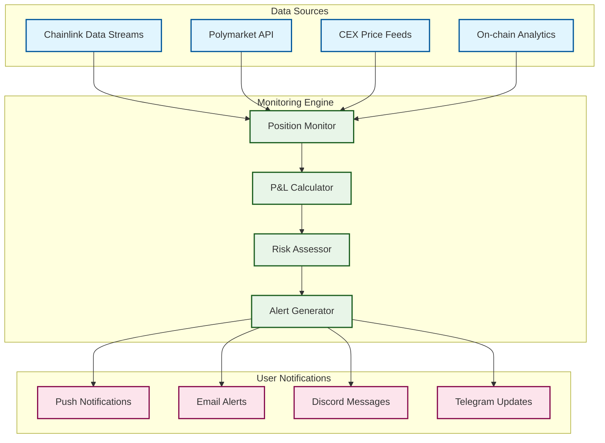

# 🎯 Complete User Interaction Flows
## Chainlink Multi-Agent Swarm Cross-Chain AI Prediction Market Arbitrage Network

## 1. User Onboarding Flow



## 2. Complete User Journey: From Login to Profit



## 3. Contract Function Usage by User Actions

### 3.1 Initial Setup Functions

| User Action | Contract Function | Parameters | Description |
|------------|------------------|------------|-------------|
| Register Account | `registerAgent()` | `address user, string role` | Authorizes user for platform access |
| Set Risk Limits | `setUserRiskLimits()` | `uint256 maxPosition, uint256 maxLoss` | Configure personal risk management |
| Deposit Funds | `depositFunds()` | `address token, uint256 amount` | Add capital for trading |

### 3.2 Market Analysis Functions

| User Action | Contract Function | Parameters | Description |
|------------|------------------|------------|-------------|
| Scan Markets | `requestMarketData()` | `string marketId, uint256 chainId` | Trigger market analysis |
| Get Predictions | `requestPrediction()` | `string marketId, uint256 timeHorizon` | Request AI predictions |
| View Opportunities | `getArbitrageOpportunities()` | `address user` | List available strategies |
| Check Prices | `getLatestPrice()` | `bytes32 feedId` | Get current market prices |

### 3.3 Strategy Execution Functions

| User Action | Contract Function | Parameters | Description |
|------------|------------------|------------|-------------|
| Execute Strategy | `executeArbitrage()` | `string marketId, uint256 amount, uint64 targetChain` | Start arbitrage execution |
| Monitor Position | `getActivePositions()` | `address user` | View open positions |
| Emergency Stop | `emergencyStop()` | `none` | Halt all operations |
| Withdraw Profits | `withdrawProfits()` | `uint256 amount, address token` | Extract earnings |

### 3.4 Portfolio Management Functions

| User Action | Contract Function | Parameters | Description |
|------------|------------------|------------|-------------|
| Check Portfolio | `getPortfolioValue()` | `address user` | View total portfolio worth |
| Update Limits | `updatePortfolioLimits()` | `uint256 maxExposure` | Adjust risk parameters |
| View History | `getTradeHistory()` | `address user, uint256 limit` | Show past trades |
| Calculate PnL | `calculateUnrealizedPnL()` | `address user` | Get unrealized profits |

## 4. User Interface Interaction Flows

### 4.1 Discord Bot Commands

```mermaid
graph TB
    USER[Discord User] --> CMD1[/scan markets]
    USER --> CMD2[/predict BTC]
    USER --> CMD3[/execute strategy]
    USER --> CMD4[/portfolio]
    USER --> CMD5[/withdraw]

    CMD1 --> BOT[Discord Bot]
    CMD2 --> BOT
    CMD3 --> BOT
    CMD4 --> BOT
    CMD5 --> BOT

    BOT --> AC[Arbitrage Coordinator]
    AC --> RESULT[Formatted Response]
    RESULT --> USER

    classDef user fill:#7289da,color:#fff,stroke:#7289da,stroke-width:2px
    classDef command fill:#f3e5f5,stroke:#4a148c,stroke-width:2px
    classDef system fill:#e8f5e8,stroke:#1b5e20,stroke-width:2px

    class USER user
    class CMD1,CMD2,CMD3,CMD4,CMD5 command
    class BOT,AC,RESULT system
```

### 4.2 Telegram Bot Workflow



### 4.3 Web Dashboard User Flow

```mermaid
graph TB
    subgraph "Authentication"
        LOGIN[Login Page] --> WALLET[Connect Wallet]
        WALLET --> AUTH[Verify Signature]
        AUTH --> DASHBOARD[Main Dashboard]
    end

    subgraph "Market Analysis"
        DASHBOARD --> SCAN[Market Scanner]
        SCAN --> OPPS[Opportunities List]
        OPPS --> DETAILS[Strategy Details]
        DETAILS --> PREDICT[AI Predictions]
    end

    subgraph "Strategy Execution"
        PREDICT --> SIZE[Position Sizing]
        SIZE --> RISK[Risk Assessment]
        RISK --> CONFIRM[Execution Confirmation]
        CONFIRM --> EXECUTE[Execute Strategy]
    end

    subgraph "Portfolio Management"
        EXECUTE --> MONITOR[Position Monitoring]
        MONITOR --> PNL[P&L Tracking]
        PNL --> WITHDRAW[Profit Withdrawal]
        WITHDRAW --> HISTORY[Trade History]
    end

    subgraph "Advanced Features"
        HISTORY --> ANALYTICS[Performance Analytics]
        ANALYTICS --> SETTINGS[Strategy Settings]
        SETTINGS --> ALERTS[Price Alerts]
        ALERTS --> API[API Access]
    end

    classDef auth fill:#e1f5fe,stroke:#01579b,stroke-width:2px
    classDef analysis fill:#e8f5e8,stroke:#1b5e20,stroke-width:2px
    classDef execution fill:#fff3e0,stroke:#e65100,stroke-width:2px
    classDef portfolio fill:#f3e5f5,stroke:#4a148c,stroke-width:2px
    classDef advanced fill:#fce4ec,stroke:#880e4f,stroke-width:2px

    class LOGIN,WALLET,AUTH,DASHBOARD auth
    class SCAN,OPPS,DETAILS,PREDICT analysis
    class SIZE,RISK,CONFIRM,EXECUTE execution
    class MONITOR,PNL,WITHDRAW,HISTORY portfolio
    class ANALYTICS,SETTINGS,ALERTS,API advanced
```



## 5. Error Handling & Edge Cases

### 5.1 Transaction Failure Recovery



### 5.2 Emergency Stop Procedures

```mermaid
graph TB
    TRIGGER[Emergency Trigger] --> STOP[emergencyStop()]
    STOP --> PAUSE[Pause all operations]
    PAUSE --> CANCEL[Cancel pending transactions]
    CANCEL --> SECURE[Secure user funds]
    SECURE --> NOTIFY[Notify all users]
    NOTIFY --> INVESTIGATE[Team investigation]
    INVESTIGATE --> RESOLVE{Issue resolved?}
    RESOLVE -->|Yes| RESUME[Resume operations]
    RESOLVE -->|No| MAINTAIN[Maintain pause state]
    RESUME --> NORMAL[Normal operations]

    classDef emergency fill:#ffebee,stroke:#c62828,stroke-width:2px
    classDef process fill:#e8f5e8,stroke:#1b5e20,stroke-width:2px
    classDef decision fill:#fff3e0,stroke:#e65100,stroke-width:2px

    class TRIGGER,STOP,PAUSE emergency
    class CANCEL,SECURE,NOTIFY,INVESTIGATE,RESUME,MAINTAIN,NORMAL process
    class RESOLVE decision
```

## 6. Real-Time Monitoring & Alerts

### 6.1 Position Monitoring Flow



## 7. API Integration Guide

### 7.1 REST API Endpoints

| Endpoint | Method | Description | Contract Function |
|----------|--------|-------------|------------------|
| `/api/markets/scan` | GET | Get arbitrage opportunities | `getArbitrageOpportunities()` |
| `/api/predictions/{marketId}` | GET | Get AI predictions | `getPredictionResults()` |
| `/api/positions/execute` | POST | Execute arbitrage strategy | `executeArbitrage()` |
| `/api/portfolio/{address}` | GET | Get portfolio value | `getPortfolioValue()` |
| `/api/positions/{address}` | GET | Get active positions | `getActivePositions()` |
| `/api/profits/withdraw` | POST | Withdraw profits | `withdrawProfits()` |

### 7.2 WebSocket Events

| Event | Description | Data Format |
|-------|-------------|-------------|
| `opportunity_detected` | New arbitrage opportunity | `{marketId, profit, risk, chains}` |
| `position_opened` | Strategy execution started | `{positionId, amount, strategy}` |
| `pnl_update` | Real-time profit/loss | `{positionId, unrealizedPnL, realizedPnL}` |
| `position_closed` | Strategy completed | `{positionId, finalProfit, duration}` |
| `alert_triggered` | Risk or price alert | `{alertType, message, severity}` |

## 8. Mobile App User Journey

```mermaid
graph TB
    subgraph "Mobile Experience"
        OPEN[Open mobile app] --> BIOMETRIC[Biometric login]
        BIOMETRIC --> DASH[Dashboard overview]
        DASH --> QUICK[Quick actions menu]
        
        QUICK --> SCAN[Tap: Scan markets]
        QUICK --> PORTFOLIO[Tap: View portfolio]
        QUICK --> EXECUTE[Tap: Execute strategy]
        
        SCAN --> RESULTS[Show opportunities]
        RESULTS --> SELECT[Select strategy]
        SELECT --> AMOUNT[Enter amount]
        AMOUNT --> SWIPE[Swipe to execute]
        SWIPE --> CONFIRM[Biometric confirmation]
        CONFIRM --> EXECUTING[Strategy executing...]
        EXECUTING --> NOTIFICATION[Push notification: Complete!]
    end

    classDef mobile fill:#4caf50,color:#fff,stroke:#4caf50,stroke-width:2px
    classDef action fill:#2196f3,color:#fff,stroke:#2196f3,stroke-width:2px
    classDef execution fill:#ff9800,color:#fff,stroke:#ff9800,stroke-width:2px

    class OPEN,BIOMETRIC,DASH mobile
    class QUICK,SCAN,PORTFOLIO,EXECUTE,RESULTS,SELECT action
    class AMOUNT,SWIPE,CONFIRM,EXECUTING,NOTIFICATION execution
```



---

This comprehensive guide shows every aspect of user interaction with the Chainlink Multi-Agent Swarm Cross-Chain AI Prediction Market Arbitrage Network, from initial onboarding through profit realization, across all supported interfaces (Web, Discord, Telegram, Mobile, API). 